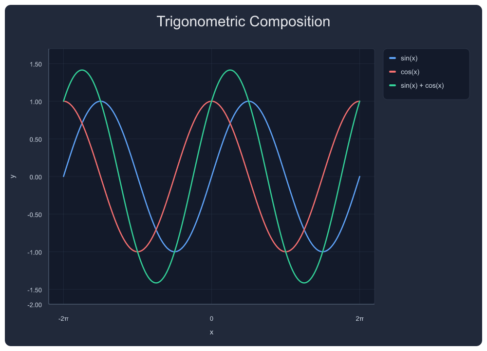
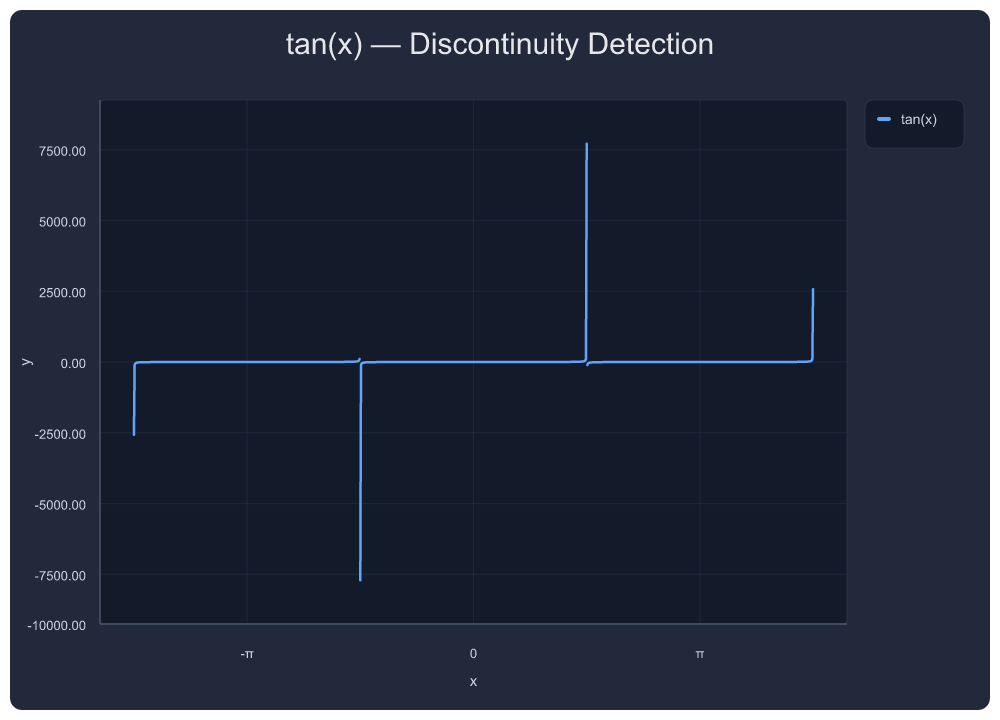
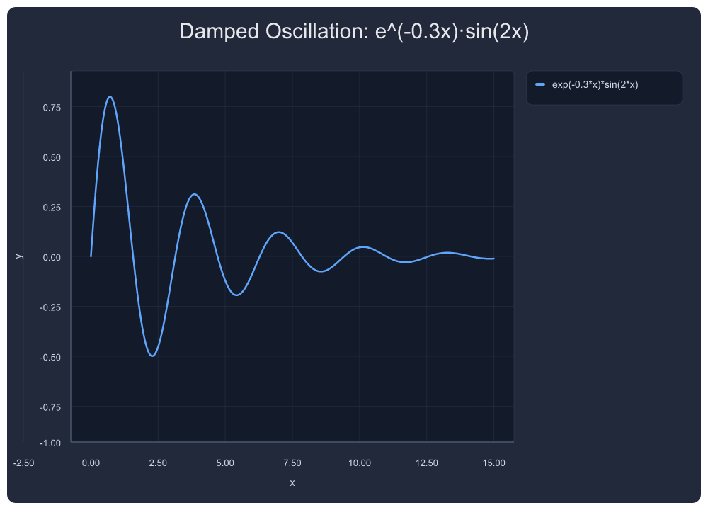
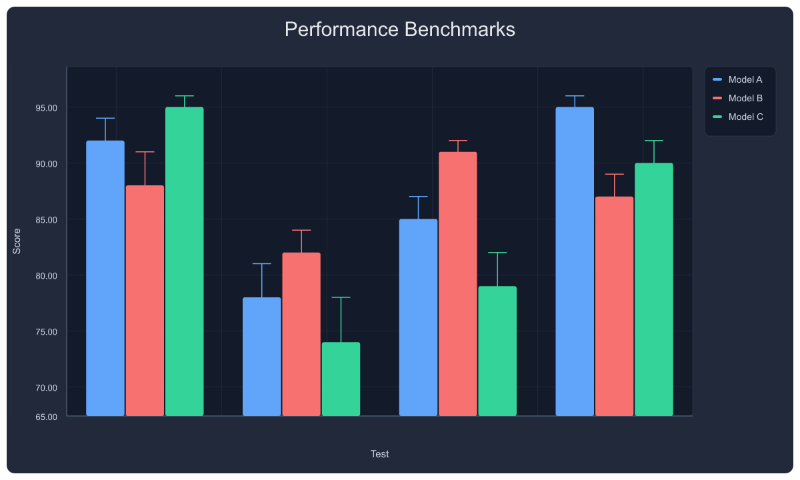

# plot-mcp-worker

Serverless chart rendering engine. Runs on Cloudflare Workers. Outputs PNG/SVG via MCP protocol.

Zero dependencies at runtime. No headless browser. Pure SVG → PNG via resvg-wasm.

---

## Showcase

### Trigonometric Composition

sin, cos, and their sum — π-formatted x-axis, trig y-special ticks `[-1, -0.5, 0, 0.5, 1]`, auto-legend outside plot area.



```json
{
  "tool": "plot_multi",
  "arguments": {
    "exprs": ["sin(x)", "cos(x)", "sin(x)+cos(x)"],
    "labels": ["sin(x)", "cos(x)", "sin(x) + cos(x)"],
    "x_min": -6.283, "x_max": 6.283,
    "title": "Trigonometric Composition"
  }
}
```

---

### Discontinuity Detection

tan(x) with automatic asymptote break detection — no spikes, no vertical lines connecting ±∞. The engine detects sign-flip + large Δy and breaks the path.



```json
{
  "tool": "plot_png_link",
  "arguments": {
    "expr": "tan(x)",
    "x_min": -4.712, "x_max": 4.712,
    "title": "tan(x) — Discontinuity Detection"
  }
}
```

---

### Damped Oscillation

Exponential decay envelope × trig — smooth rendering with automatic nice ticks on both axes.



```json
{
  "tool": "plot_png_link",
  "arguments": {
    "expr": "exp(-0.3*x)*sin(2*x)",
    "x_min": 0, "x_max": 15,
    "title": "Damped Oscillation: e^(-0.3x)·sin(2x)"
  }
}
```

---

### Rational Function with Annotations

1/(x²-1) with vertical asymptote markers. Engine renders the pole gaps correctly without artifact spikes.


```json
{
  "tool": "plot_png_link",
  "arguments": {
    "expr": "1/(x^2-1)",
    "x_min": -4, "x_max": 4,
    "title": "1/(x²-1) — Rational Function",
    "annotations": [
      {"kind": "vertical_line", "x": -1, "label": "x = -1", "color": "#f87171"},
      {"kind": "vertical_line", "x":  1, "label": "x = 1",  "color": "#f87171"}
    ]
  }
}
```

---

### Multi-Series with Error Bars

Business data: line+scatter with asymmetric error bars, grouped legend outside plot area.


```json
{
  "tool": "plot_series",
  "arguments": {
    "title": "Q1-Q4 Revenue Forecast vs Actual",
    "xlabel": "Quarter", "ylabel": "Revenue (M USD)",
    "series": [
      {"name": "Forecast", "type": "line+scatter", "points": [[1,120],[2,185],[3,310],[4,490]], "color": "#60a5fa", "error": [8,12,20,35]},
      {"name": "Actual",   "type": "line+scatter", "points": [[1,135],[2,178],[3,345],[4,510]], "color": "#f87171", "error": [5,10,15,25]},
      {"name": "Target",   "type": "line",         "points": [[1,150],[2,200],[3,300],[4,450]], "color": "#34d399"}
    ]
  }
}
```

---

### Grouped Bar Chart with Error Bars

Grouped bars with per-bar error bars, auto-category labels, dark theme legend.



```json
{
  "tool": "plot_series",
  "arguments": {
    "title": "Performance Benchmarks",
    "xlabel": "Test", "ylabel": "Score",
    "bar_style": "grouped",
    "series": [
      {"name": "Model A", "type": "bar", "points": [[0,92],[1,78],[2,85],[3,95]], "group": "g", "color": "#60a5fa", "error": [2,3,2,1]},
      {"name": "Model B", "type": "bar", "points": [[0,88],[1,82],[2,91],[3,87]], "group": "g", "color": "#f87171", "error": [3,2,1,2]},
      {"name": "Model C", "type": "bar", "points": [[0,95],[1,74],[2,79],[3,90]], "group": "g", "color": "#34d399", "error": [1,4,3,2]}
    ]
  }
}
```

---

## Features

**Rendering**
- Pure SVG generation → PNG via resvg-wasm (no headless browser)
- Transparent or dark-theme card backgrounds
- Line, scatter, line+scatter, bar, grouped bar, stacked bar, histogram, box plot, pie chart
- Multi-plot subplot grids (M×N)
- Error bars (symmetric & asymmetric) on line, scatter, and bar
- Annotations: vertical lines, points, labels, shaded areas

**Axis Engine (v0.4.13)**
- Nice ticks: 1, 2, 2.5, 5 × 10^n step selection
- Automatic π-mode x-axis for trig functions
- Trig y-special: sin/cos gets `[-1, -0.5, 0, 0.5, 1]`
- 0-symmetric y-axis for math-style function plots
- Discontinuity detection (sign-flip + large Δy → path break)
- Intent system: LLM suggests semantic mode, engine owns geometry

**Math**
- Expression parser: `sin(x)`, `exp(-0.3*x)*cos(x)`, `1/(x^2-1)`, piecewise functions
- Up to 20,000 points per series
- Transform pipeline: normalize, smooth, filter, rolling average, downsample

**Design**
- Dark theme first-class: `#0f172a` card, `#111827` plot area, `#334155` grid
- Legend outside plot area (right-side reserved)
- Math preset (1000×720) vs report preset (1200×720)
- Line halo for readability without visual noise

## MCP Tools

| Tool | Description |
|------|-------------|
| `plot` | Plot a single expression (auto-detect π, trig, etc.) |
| `plot_multi` | Plot multiple expressions on one chart |
| `plot_series` | Plot from explicit data arrays (line/scatter/bar/hist/box/pie) |
| `plot_bar` | Bar chart shorthand |
| `multi_plot` | M×N subplot grid |
| `analysis` | Statistics: describe, correlation, groupby |
| `diagram` | Force diagrams, circuit diagrams, Venn diagrams |
| `geometry_3d` | 3D shape rendering |
| `teaching` | Math teaching templates (definite integral, tangent, Fourier, etc.) |

## Deployment

```bash
npx wrangler deploy
```

Requires Cloudflare Workers with a KV namespace for short-link PNG URLs.

## License

MIT
