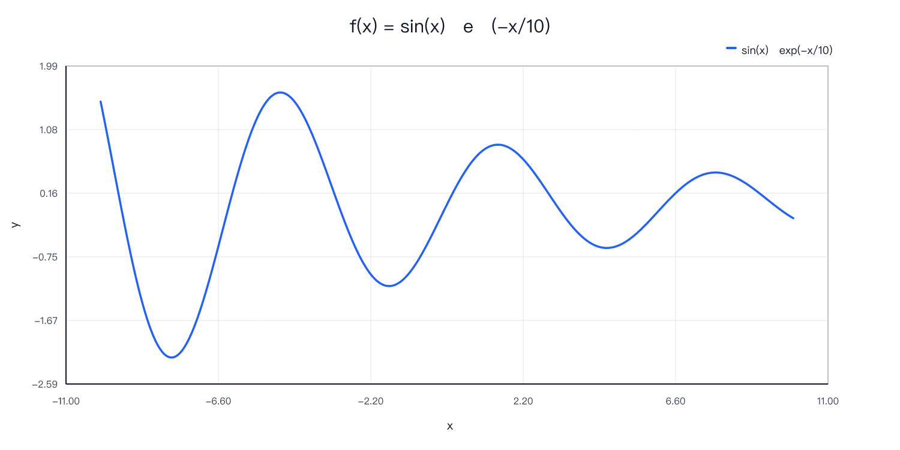
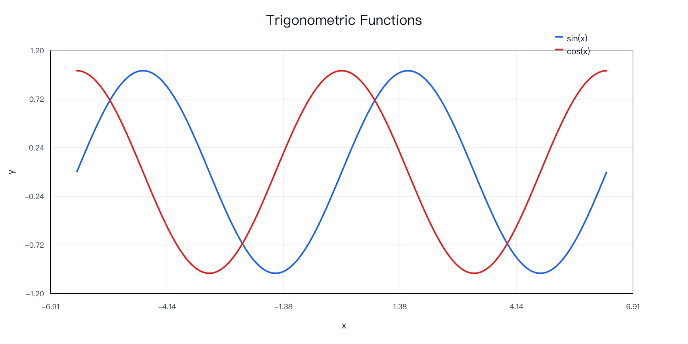
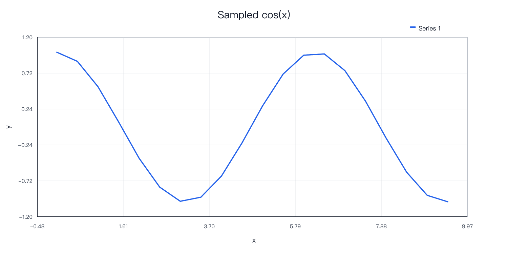
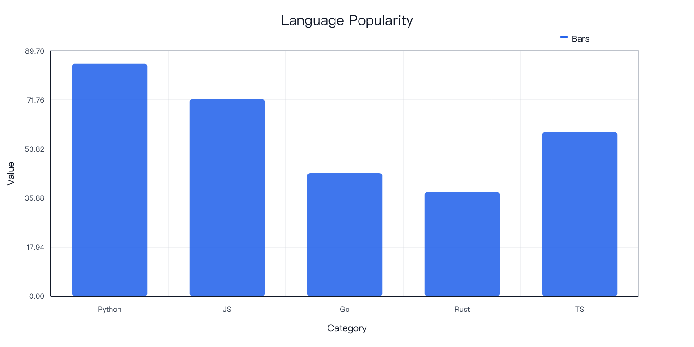
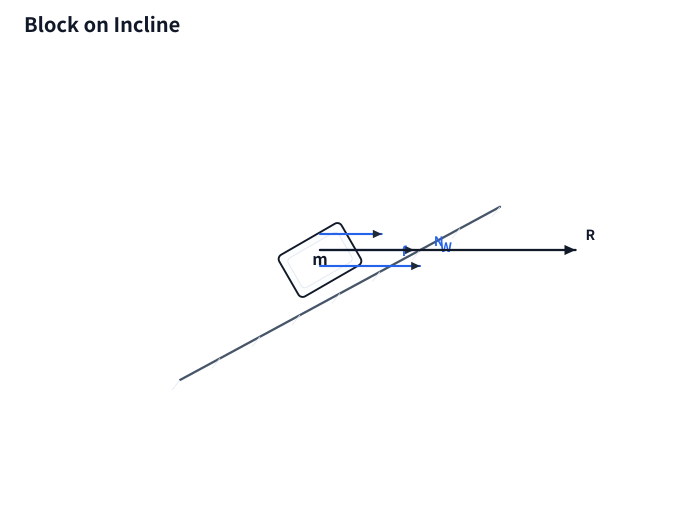
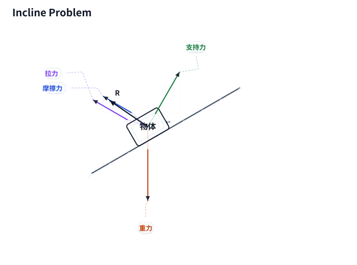
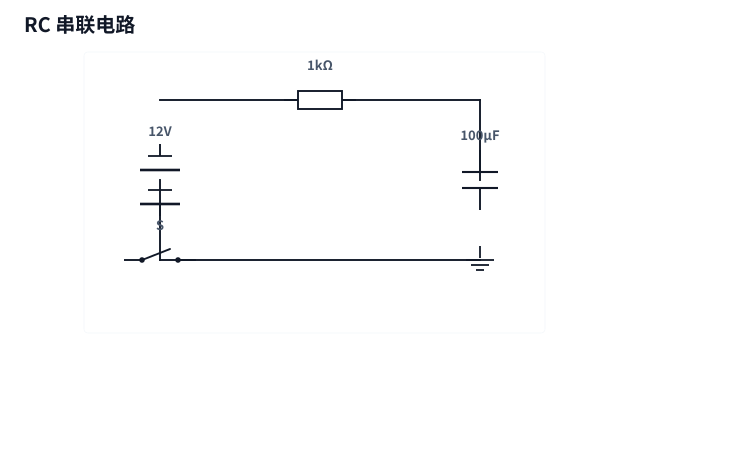
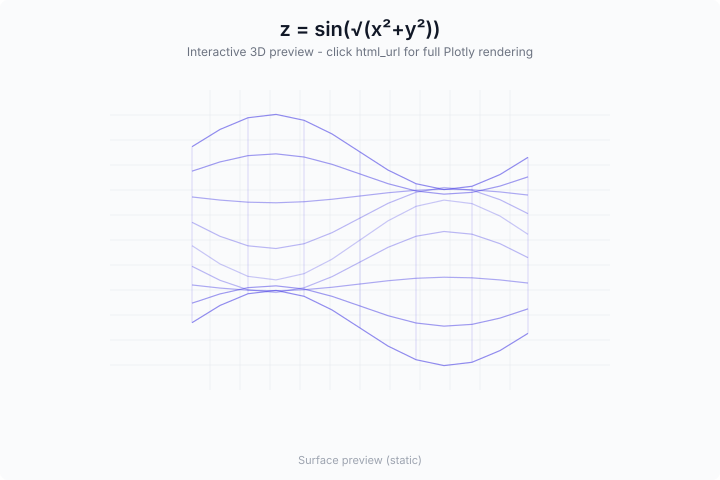

# plot-mcp-worker

A Cloudflare Worker exposing an MCP (Model Context Protocol) server for mathematical plotting, physics force diagrams, circuit schematics, 3D shape visualization, and bar charts — all rendered server-side and returned as PNG, SVG, or interactive HTML.

## What It Does

Plot MCP turns natural language requests into publication-quality images. An AI agent calls one of the tools below, the Worker computes everything on the edge (no external rendering API), and returns a rendered image or a shareable link.

- **Math plots** — single expression, multi-expression overlays, custom (x,y) series, bar charts
- **Physics diagrams** — free-body / force analysis SVGs with components, resultants, angles, inclines
- **Circuit schematics** — batteries, resistors, lamps, switches, meters, transistors, op-amps. Grid-based coordinate system with automatic spacing.
- **3D shapes** — interactive Plotly viewers for spheres, cubes, cones, tori, cylinders, pyramids, and mathematical surface plots with static SVG previews
- **Template shortcuts** — common mechanics setups (incline, hanging mass, pulley) and circuit topologies (series, parallel, LED+resistor)

Chinese font rendering (PingFang SC) is built into the Worker bundle.

## MCP Tools

### Plotting

| Tool | Returns | Description |
|------|---------|-------------|
| `plot` | PNG image | Plot a single expression |
| `plot_json` | PNG base64 payload | Same, with structured response |
| `plot_png_link` | Direct PNG URL | Same, returns a shareable link |
| `plot_multi` | PNG image | Plot multiple expressions on one chart |
| `plot_multi_json` | PNG base64 payload | Same, structured response |
| `plot_multi_png_link` | Direct PNG URL | Same, shareable link |
| `plot_series` | PNG image | Plot custom (x,y) point series |
| `plot_series_json` | PNG base64 payload | Same, structured response |
| `plot_series_png_link` | Direct PNG URL | Same, shareable link |
| `plot_bar_json` | PNG base64 payload | Render a bar chart |
| `plot_multi_images` | Multiple images | Batch-generate several plots in one call |

<p align="center">
  
  
</p>
<p align="center">
  
  
</p>

### Physics Force Diagrams

| Tool | Returns | Description |
|------|---------|-------------|
| `force_diagram_link` | SVG link | Basic free-body diagram |
| `force_analysis_link` | SVG link | Full analysis with axes, components, resultant, incline |
| `force_analysis_template_link` | SVG link | Pre-built templates: incline, hanging, horizontal, pulley, spring, double_block, pulley_group, spring_oscillator |

<p align="center">
  
  
</p>

### Circuit Diagrams

| Tool | Returns | Description |
|------|---------|-------------|
| `circuit_diagram_link` | SVG link | Custom circuit with components, wires, stages, branches |
| `circuit_template_link` | SVG link | Pre-built: series, parallel, switch_lamp, source_resistor, led_resistor, meter_loop, transistor_switch, relay_driver, buzzer_loop, opamp_follower |

<p align="center">
  
</p>

### 3D Shapes

| Tool | Returns | Description |
|------|---------|-------------|
| `shape3d_link` | SVG preview + interactive HTML | 3D surface rendering. Returns a static SVG contour preview (`svg_url`) for MCP clients, plus an interactive Plotly viewer (`html_url`). Supports multi-surface overlays, custom color scales, and contour lines. |

<p align="center">
  
</p>

### Utility

| Tool | Description |
|------|-------------|
| `health` | Check worker health and list available tools |

## Quick Start

### Local Development

```bash
npm install
npx wrangler dev --local --port 8790
```

Health check:

```bash
curl http://127.0.0.1:8790/healthz
```

### Deploy

```bash
npx wrangler deploy
```

All rendering happens in-worker — no upstream dependencies.

## Project Structure

```
plot-mcp-worker/
├── src/
│   └── index.js        # Worker entry, MCP tool handlers, rendering logic
├── wrangler.toml       # Cloudflare Worker config
├── package.json
└── README.md
```

## Configuration

Environment variables (set in `wrangler.toml` or Cloudflare dashboard):

None required. The Worker is fully self-contained.

## Limits

| Parameter | Limit |
|-----------|-------|
| Points per plot | 10 – 20,000 |
| Expression length | 400 chars |
| Title / label length | 120 / 80 chars |
| Series per chart | 12 |
| Force bodies / surfaces / connectors | 16 / 6 / 10 |
| Circuit components / wires | 24 / 48 |

## License

Private repository. All rights reserved.
