<p align="center">
  
</p>

<h1 align="center">plot-mcp-worker</h1>

<p align="center">
  A serverless MCP chart rendering engine on Cloudflare Workers.<br>
  Let any AI agent generate PNG/SVG charts, STEM diagrams, and visualizations from a single JSON call.
</p>

<p align="center">
  
  
  
  
  
  <a href="README_CN.md"></a>
</p>

---

> **Keywords:** MCP server, Model Context Protocol, chart generation, function plot, data visualization, STEM diagram, physics force diagram, circuit schematic, 3D geometry, Venn diagram, Cloudflare Workers, serverless, SVG rendering, AI agent tools, Claude MCP, math plotter

---

---

## Quick Start

### Use with any MCP client

Add to your MCP client configuration (Claude Desktop, Cursor, etc.):

```json
{
  "mcpServers": {
    "plot": {
      "url": "https://<your-worker>.<your-subdomain>.workers.dev/mcp"
    }
  }
}
```

No API key needed for the public endpoint. Your AI agent can now generate charts.

> **Fair use:** The public endpoint is provided for experimentation and integration testing. For production use or higher-volume workloads, [self-hosting](#self-host-deploy-your-own) is recommended.

### Use via HTTP

```bash
curl -X POST https://<your-worker>.<your-subdomain>.workers.dev/mcp \
  -H "Content-Type: application/json" \
  -d '{
    "jsonrpc": "2.0", "id": 1,
    "method": "tools/call",
    "params": {
      "name": "plot_png_link",
      "arguments": {"expr": "sin(x)", "title": "Sine Wave"}
    }
  }'
```

Returns JSON with a `png_url`. Pre-rendered PNG, 5-minute cache.

### Direct PNG/SVG URLs

```
https://<your-worker>.<your-subdomain>.workers.dev/png?d=<base64url-encoded-params>
https://<your-worker>.<your-subdomain>.workers.dev/plot?d=<base64url-encoded-params>
```

Use `plot_png_link` or `plot` tool to get properly encoded URLs.

---

## Recommended Tools

**Start here.** These four tools cover 95% of use cases:

| Tool | When to use |
|------|-------------|
| **`plot`** / **`plot_png_link`** | Single function or expression — `sin(x)`, `exp(-x)*cos(x)`, etc. Supports annotations, custom ranges, layout presets. |
| **`plot_multi`** | Multiple expressions overlaid — compare functions, show decompositions. |
| **`plot_series`** | Data-driven charts — line, scatter, bar (grouped/stacked), histogram, box plot, pie. Accepts raw data arrays with optional error bars and transforms. |
| **`multi_plot`** | Subplot grids — M×N layout of any chart types in one figure. |

### Legacy / Specialized Tools

These remain supported for compatibility and niche workflows. New integrations should prefer the four tools above.

| Tool | Use case |
|------|----------|
| `plot_bar` | Quick bar chart shorthand (categories + values) |
| `teaching` | Built-in math education templates (definite integral, derivative tangent, Fourier, projectile, etc.) |
| `analysis` | Statistical summaries — describe, correlation, groupby |
| `force_diagram_link` | Physics force diagrams |
| `circuit_diagram_link` | Circuit schematics |
| `venn_diagram_link` | Venn diagrams |
| `c_memory_diagram_link` | C memory layout diagrams |
| `plot_json` | Raw spec input (advanced) |

---

## Smart Defaults

The engine does a lot before you touch any option:

### Axis Intelligence
- **Nice ticks**: Step selection from 1, 2, 2.5, 5 × 10ⁿ — no ugly values like 0.72 or 1.2
- **Auto π-mode**: Trig functions automatically get π-formatted x-axis (`-2π, -π, 0, π, 2π`)
- **Trig y-special**: sin/cos gets `[-1, -0.5, 0, 0.5, 1]` instead of arbitrary decimals
- **0-symmetric**: Math-style function plots default to symmetric y-axis around zero
- **Log scale**: Set `y_scale: "log"` for logarithmic y-axis with proper tick formatting

### Discontinuity Handling
- **Asymptote detection**: Sign-flip + large Δy triggers path break — no vertical spikes at asymptotes
- **IQR bounds clamping**: Extreme values near asymptotes (e.g., tan(x) at ±π/2) are automatically clamped using interquartile range filtering, keeping the y-axis readable

### Visual Design
- **Dark theme by default**: `#0f172a` card, `#111827` plot area, `#334155` grid — publication-ready out of the box
- **Legend outside plot area**: Right-side reserved, never overlaps data
- **Canvas presets**: Math (1000×720) for functions, Report (1200×720) for data charts
- **CJK support**: 7500+ glyphs (GB2312 + punctuation + math symbols) via text-to-path pipeline
- **Color palette**: `#60a5fa, #f87171, #34d399, #fbbf24, #a78bfa, #22d3ee, #fb923c, #f472b6`

### Annotations

Three annotation types, placed in separate visual layers:

```json
"annotations": [
  {"kind": "point", "x": 1.471, "y": 0.859, "label": "Peak", "color": "#fbbf24"},
  {"kind": "area", "x_min": 0.8, "x_max": 2.2, "label": "Region", "color": "#60a5fa", "opacity": 0.12},
  {"kind": "vertical_line", "x": 6.93, "label": "Half-life", "color": "#f87171"}
]
```

Layout: points → above-right of marker; areas → inside lower region; vertical lines → bottom of plot. Local collision avoidance is basic in the current version and will be improved.

### Expression Syntax

Powered by [expr-eval](https://github.com/silentmatt/expr-eval):

- Functions: `sin`, `cos`, `tan`, `exp`, `log`, `sqrt`, `abs`, `floor`, `ceil`, `round`
- Constants: `pi`, `e`
- Operators: `+`, `-`, `*`, `/`, `^` (power), `%` (mod)

---

## Response Shape

### PNG link (plot, plot_multi, plot_series, multi_plot)

```json
{
  "ok": true,
  "png_url": "https://<your-worker>.<your-subdomain>.workers.dev/png?d=...",
  "warnings": []
}
```

### Debug mode (debug: true)

```json
{
  "ok": true,
  "spec": { "xMin": -6.28, "xMax": 6.28, "yMin": -1.2, "yMax": 1.2 },
  "warnings": [{"type": "bounds", "message": "y-range clamped via IQR outlier removal"}],
  "debug": {
    "stages": [
      {"name": "raw", "input": 400, "output": 400},
      {"name": "downsample", "method": "minmax", "input": 400, "output": 200}
    ]
  }
}
```

### Error

```json
{
  "ok": false,
  "error": {
    "type": "transform",
    "message": "normalize skipped due to error bars"
  }
}
```

---

## Observability & Safety

The engine doesn't just draw — it explains what it did and warns when something might be wrong.

### Debug Mode

```json
{"tool": "plot_series", "arguments": {
  "debug": true,
  "series": [{"type": "line", "name": "data", "points": [[1,2],[2,5],[3,3]]}]
}}
```

Returns a `debug` object with pipeline stages:

```json
{
  "debug": {
    "stages": [
      {"name": "raw", "input": 3, "output": 3},
      {"name": "downsample", "method": "minmax", "input": 3, "output": 3}
    ]
  }
}
```

### Structured Warnings

The engine emits warnings when it makes automatic decisions:

```json
{
  "warnings": [
    {"type": "transform", "message": "normalize skipped due to error bars"},
    {"type": "bounds", "message": "y-range clamped via IQR outlier removal (42 of 400 points excluded)"}
  ]
}
```

### Transform Policy

Control how aggressively the engine applies automatic transforms:

```json
"transformPolicy": "strict"       // fail on unsupported transforms
"transformPolicy": "best-effort"  // skip silently (default)
```

---

## Showcase

### 1. Trigonometric Composition

sin, cos, and their sum — auto-detected π-mode x-axis, trig y-special ticks.


```json
{"tool": "plot_multi", "arguments": {
  "exprs": ["sin(x)", "cos(x)", "sin(x)+cos(x)"],
  "labels": ["sin(x)", "cos(x)", "sin(x) + cos(x)"],
  "x_min": -6.283, "x_max": 6.283,
  "title": "Trigonometric Composition"
}}
```

---

### 2. Square Wave — Fourier Series Approximation

Progressively adding odd harmonics. 4 series, auto π-axis.

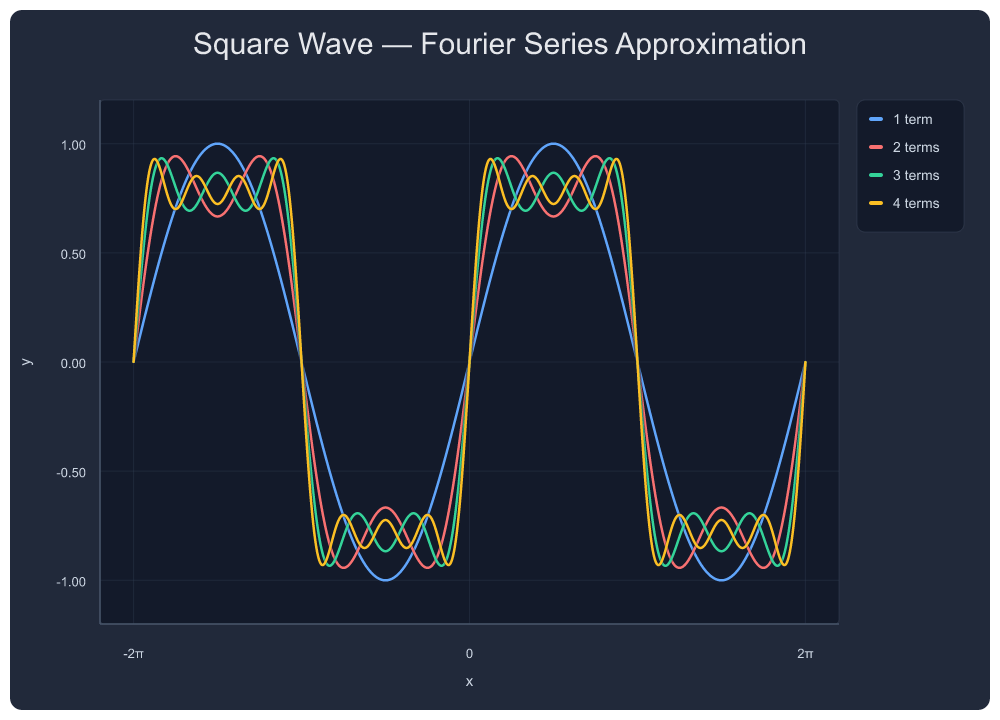

```json
{"tool": "plot_multi", "arguments": {
  "exprs": ["sin(x)", "sin(x)+sin(3*x)/3", "sin(x)+sin(3*x)/3+sin(5*x)/5", "sin(x)+sin(3*x)/3+sin(5*x)/5+sin(7*x)/7"],
  "labels": ["1 term", "2 terms", "3 terms", "4 terms"],
  "x_min": -6.283, "x_max": 6.283,
  "title": "Square Wave — Fourier Series Approximation"
}}
```

---

### 3. tan(x) — Asymptote-Aware Rendering

Automatic discontinuity detection with IQR bounds clamping. No spikes, no vertical lines connecting ±∞. Y-range stays readable near asymptotes.

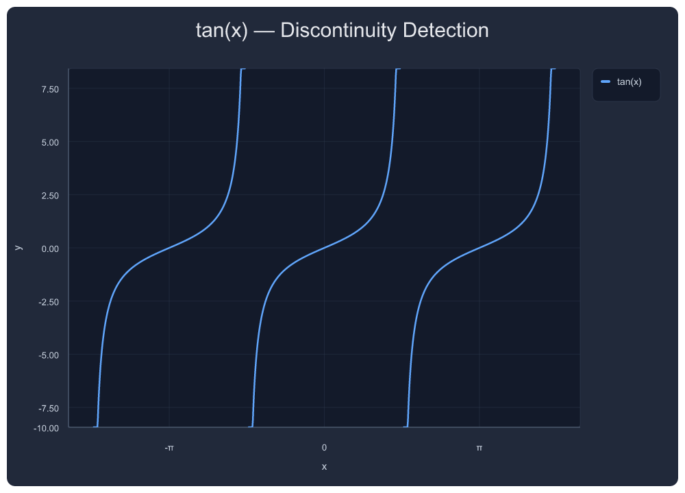

```json
{"tool": "plot_png_link", "arguments": {
  "expr": "tan(x)",
  "x_min": -4.712, "x_max": 4.712,
  "title": "tan(x) — Discontinuity Detection"
}}
```

---

### 4. sinc(x) = sin(x)/x

Removable singularity handling at x=0.

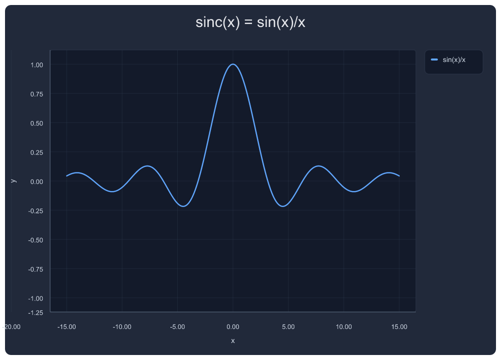

```json
{"tool": "plot_png_link", "arguments": {
  "expr": "sin(x)/x",
  "x_min": -15, "x_max": 15,
  "title": "sinc(x) = sin(x)/x"
}}
```

---

### 5. 1/(x²-1) — Rational Function with Asymptote Annotations

Vertical asymptote markers at x = ±1. Pole gaps rendered without artifact spikes.

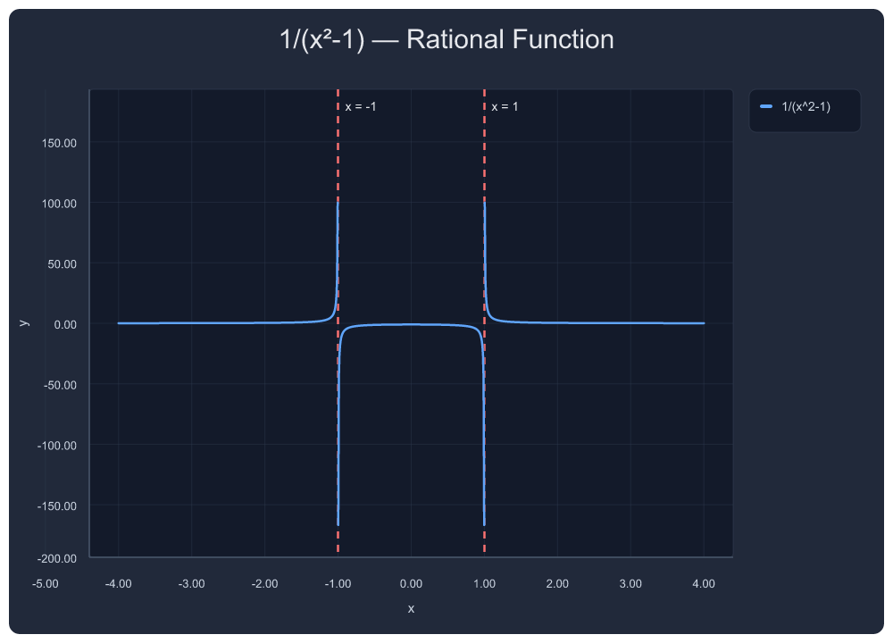

```json
{"tool": "plot_png_link", "arguments": {
  "expr": "1/(x^2-1)",
  "x_min": -4, "x_max": 4,
  "title": "1/(x²-1) — Rational Function",
  "annotations": [
    {"kind": "vertical_line", "x": -1, "label": "x = -1", "color": "#f87171"},
    {"kind": "vertical_line", "x":  1, "label": "x = 1",  "color": "#f87171"}
  ]
}}
```

---

### 6. Damped Oscillation

Exponential decay × trig — automatic nice ticks, smooth rendering across 15 units.

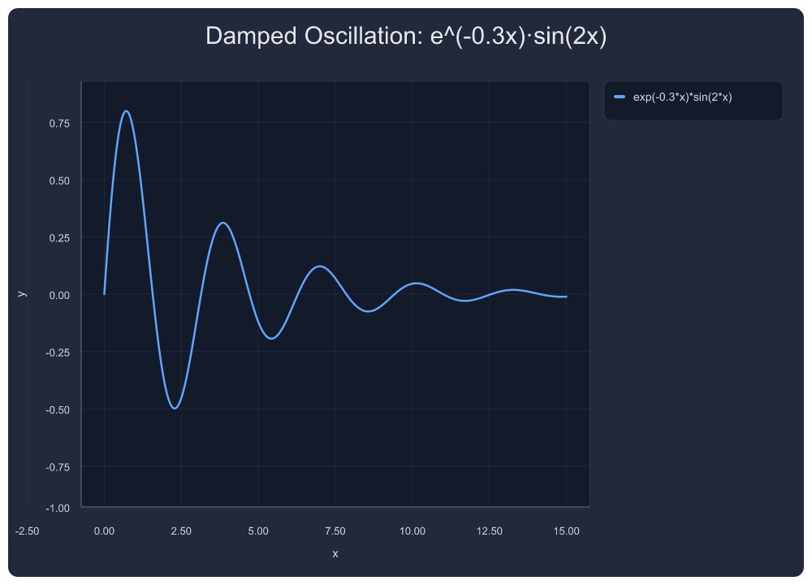

```json
{"tool": "plot_png_link", "arguments": {
  "expr": "exp(-0.3*x)*sin(2*x)",
  "x_min": 0, "x_max": 15,
  "title": "Damped Oscillation: e^(-0.3x)·sin(2x)"
}}
```

---

### 7. |sin(x)|·cos(x) — Rectified Product

Absolute value composition — non-trivial waveform with sign changes.

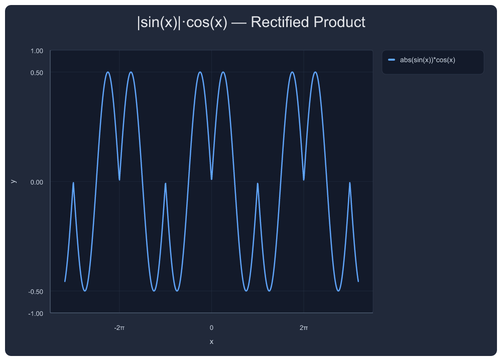

```json
{"tool": "plot_png_link", "arguments": {
  "expr": "abs(sin(x))*cos(x)",
  "x_min": -10, "x_max": 10,
  "title": "|sin(x)|·cos(x) — Rectified Product"
}}
```

---

### 8. Gaussian Mixture Model

Three Gaussians with different means and variances.

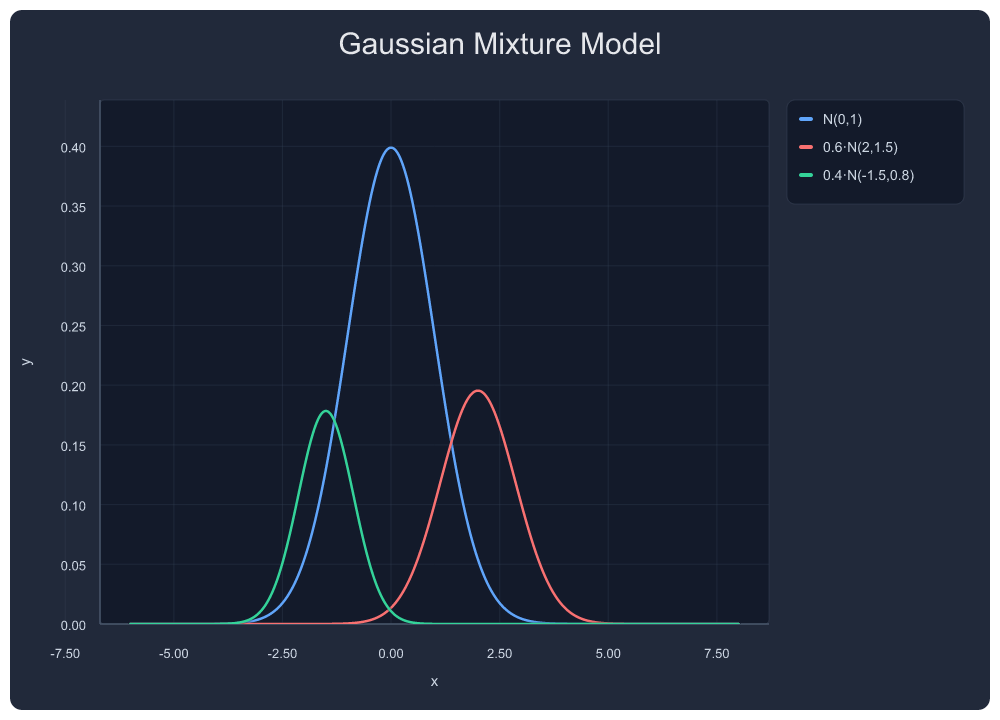

```json
{"tool": "plot_multi", "arguments": {
  "exprs": ["exp(-x*x/2)/sqrt(2*3.14159)", "0.6*exp(-(x-2)*(x-2)/1.5)/sqrt(2*3.14159*1.5)", "0.4*exp(-(x+1.5)*(x+1.5)/0.8)/sqrt(2*3.14159*0.8)"],
  "labels": ["N(0,1)", "0.6·N(2,1.5)", "0.4·N(-1.5,0.8)"],
  "x_min": -6, "x_max": 8,
  "title": "Gaussian Mixture Model"
}}
```

---

### 9. Decaying Sine with Annotations

Area shading, point markers, vertical line — all annotation types in one chart. Points placed at mathematically correct peak locations (derived from f'(x)=0). Annotation layout uses layered placement: points above-right, areas inside-lower, vertical lines at bottom.

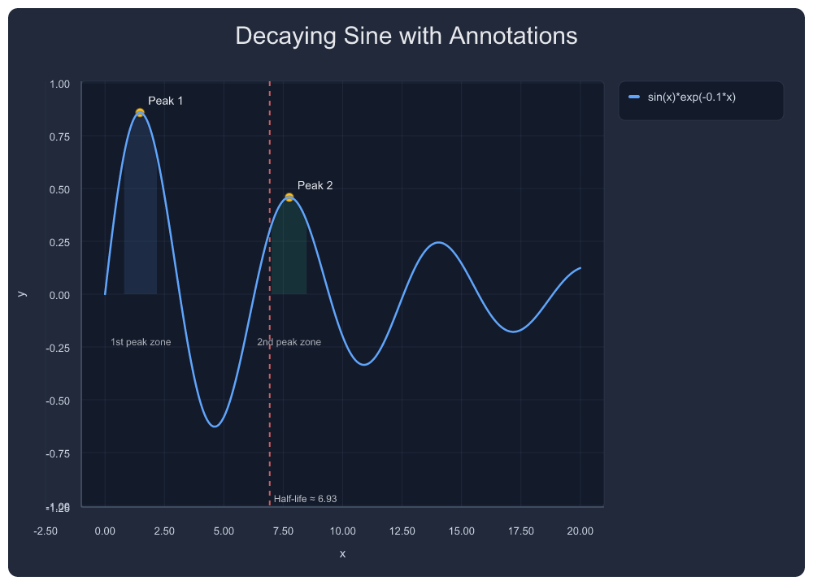

```json
{"tool": "plot_png_link", "arguments": {
  "expr": "sin(x)*exp(-0.1*x)",
  "x_min": 0, "x_max": 20,
  "title": "Decaying Sine with Annotations",
  "annotations": [
    {"kind": "area", "x_min": 0.8, "x_max": 2.2, "label": "1st peak zone", "color": "#60a5fa", "opacity": 0.12},
    {"kind": "area", "x_min": 7.0, "x_max": 8.5, "label": "2nd peak zone", "color": "#34d399", "opacity": 0.12},
    {"kind": "point", "x": 1.471, "y": 0.859, "label": "Peak 1", "color": "#fbbf24"},
    {"kind": "point", "x": 7.754, "y": 0.458, "label": "Peak 2", "color": "#fbbf24"},
    {"kind": "vertical_line", "x": 6.93, "label": "Half-life ≈ 6.93", "color": "#f87171"}
  ]
}}
```

---

### 10. Multi-Series Business Chart with Error Bars

Forecast vs Actual vs Target — symmetric error bars on scatter.

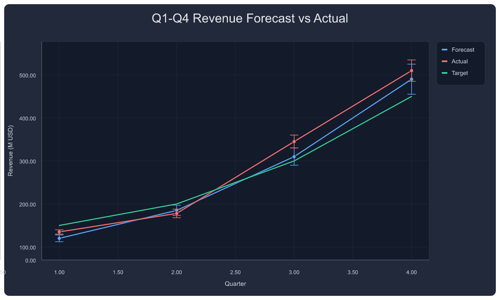

```json
{"tool": "plot_series", "arguments": {
  "title": "Q1-Q4 Revenue Forecast vs Actual",
  "xlabel": "Quarter", "ylabel": "Revenue (M USD)",
  "series": [
    {"name": "Forecast", "type": "line+scatter", "points": [[1,120],[2,185],[3,310],[4,490]], "color": "#60a5fa", "error": [8,12,20,35]},
    {"name": "Actual",   "type": "line+scatter", "points": [[1,135],[2,178],[3,345],[4,510]], "color": "#f87171", "error": [5,10,15,25]},
    {"name": "Target",   "type": "line",         "points": [[1,150],[2,200],[3,300],[4,450]], "color": "#34d399"}
  ]
}}
```

---

### 11. Grouped Bar Chart with Error Bars

3 models × 4 tests — per-bar error bars, auto-category labels.

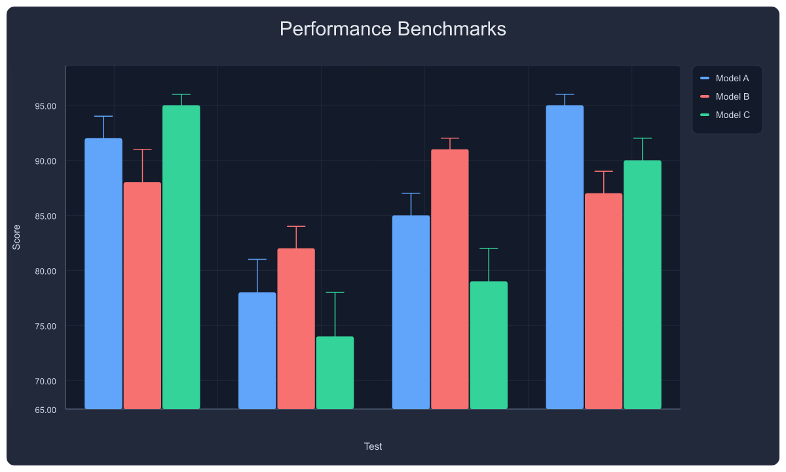

```json
{"tool": "plot_series", "arguments": {
  "title": "Performance Benchmarks",
  "xlabel": "Test", "ylabel": "Score",
  "bar_style": "grouped",
  "series": [
    {"name": "Model A", "type": "bar", "points": [[0,92],[1,78],[2,85],[3,95]], "group": "g", "color": "#60a5fa", "error": [2,3,2,1]},
    {"name": "Model B", "type": "bar", "points": [[0,88],[1,82],[2,91],[3,87]], "group": "g", "color": "#f87171", "error": [3,2,1,2]},
    {"name": "Model C", "type": "bar", "points": [[0,95],[1,74],[2,79],[3,90]], "group": "g", "color": "#34d399", "error": [1,4,3,2]}
  ]
}}
```

---

### 12. Stacked Bar Chart

Cloud cost breakdown — compute, storage, network stacked by month.

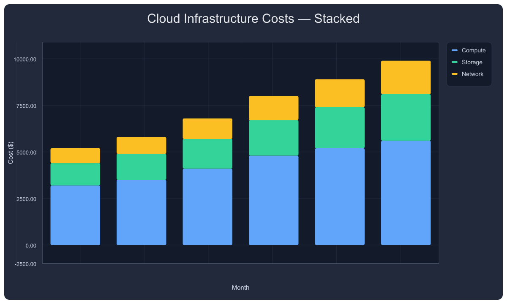

```json
{"tool": "plot_series", "arguments": {
  "title": "Cloud Infrastructure Costs — Stacked",
  "xlabel": "Month", "ylabel": "Cost ($)",
  "bar_style": "stacked",
  "series": [
    {"name": "Compute", "type": "bar", "points": [[1,3200],[2,3500],[3,4100],[4,4800],[5,5200],[6,5600]], "group": "g", "color": "#60a5fa"},
    {"name": "Storage", "type": "bar", "points": [[1,1200],[2,1400],[3,1600],[4,1900],[5,2200],[6,2500]], "group": "g", "color": "#34d399"},
    {"name": "Network", "type": "bar", "points": [[1,800],[2,900],[3,1100],[4,1300],[5,1500],[6,1800]], "group": "g", "color": "#fbbf24"}
  ]
}}
```

---

### 13. Pie Chart

Team time allocation with percentage labels.

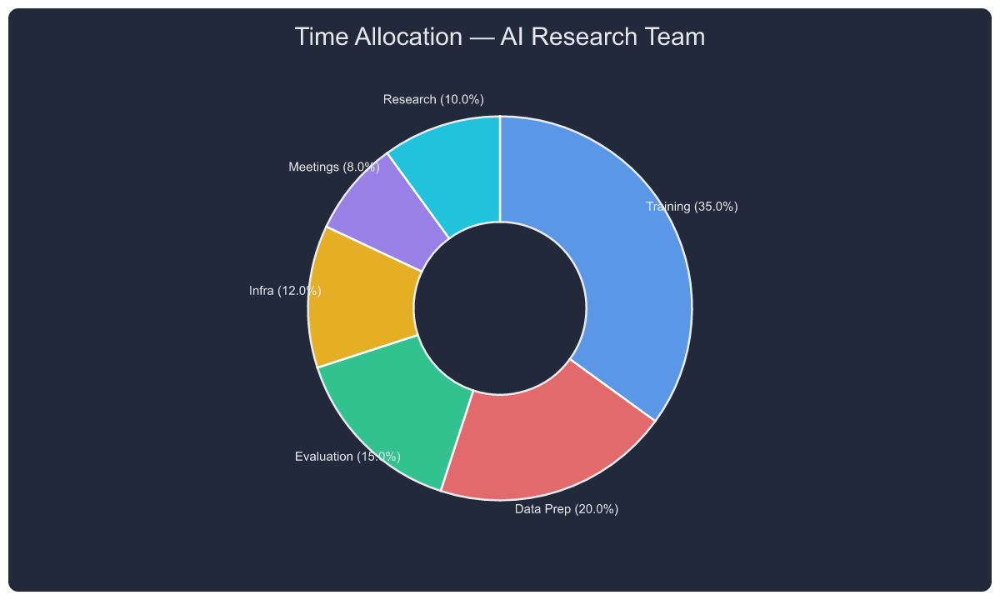

```json
{"tool": "plot_series", "arguments": {
  "title": "Time Allocation — AI Research Team",
  "series": [{"type": "pie", "name": "team", "labels": ["Training","Data Prep","Evaluation","Infra","Meetings","Research"], "values": [35,20,15,12,8,10]}]
}}
```

---

### 14. Histogram

Response latency distribution with auto-binning.

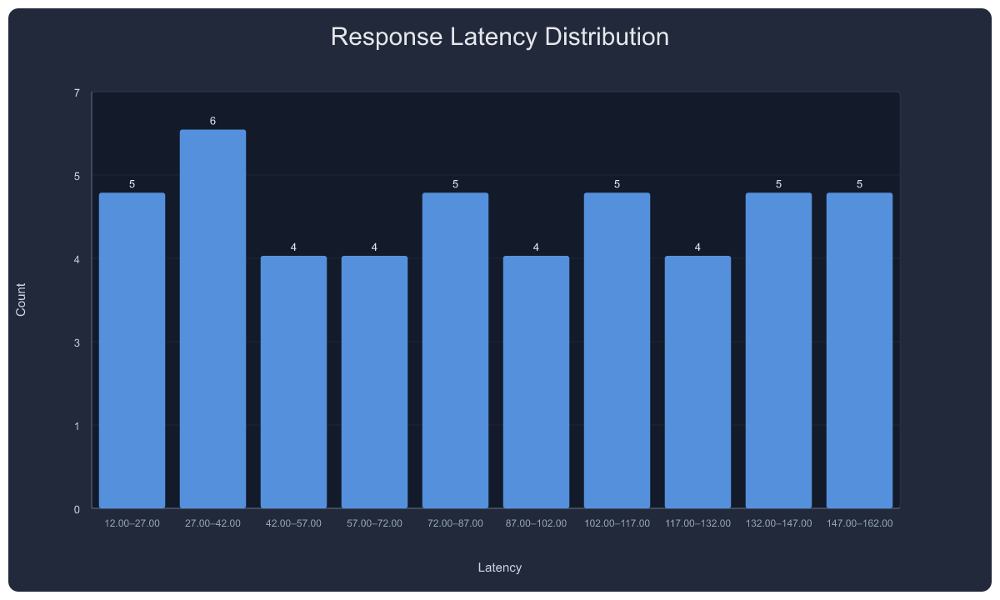

```json
{"tool": "plot_series", "arguments": {
  "title": "Response Latency Distribution",
  "xlabel": "Latency", "ylabel": "Count",
  "series": [{"type": "hist", "name": "latency", "data": [12,15,18,22,25,28,30,32,35,38,41,45,48,52,55,58,62,65,68,72,75,78,82,85,88,92,95,98,102,105,108,112,115,118,122,125,128,132,135,138,142,145,148,152,155,158,162], "bins": 10}]
}}
```

---

### 15. Box Plot

Model accuracy comparison — median, quartiles, whiskers, outliers.

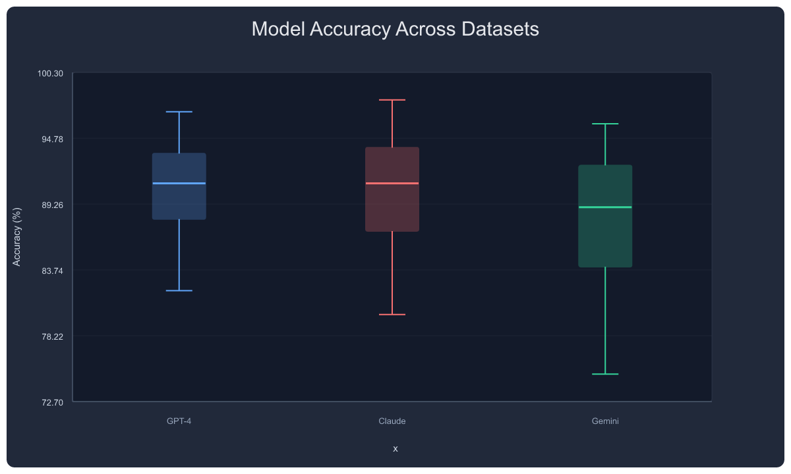

```json
{"tool": "plot_series", "arguments": {
  "title": "Model Accuracy Across Datasets",
  "ylabel": "Accuracy (%)",
  "series": [
    {"type": "box", "name": "GPT-4",  "data": [82,85,87,89,90,91,92,93,94,95,97]},
    {"type": "box", "name": "Claude", "data": [80,84,86,88,90,91,92,93,95,96,98]},
    {"type": "box", "name": "Gemini", "data": [75,79,83,85,87,89,90,92,93,94,96]}
  ]
}}
```

---

### 16. Log Scale

Training loss over 10 epochs — y-axis automatically switches to logarithmic tick formatting.

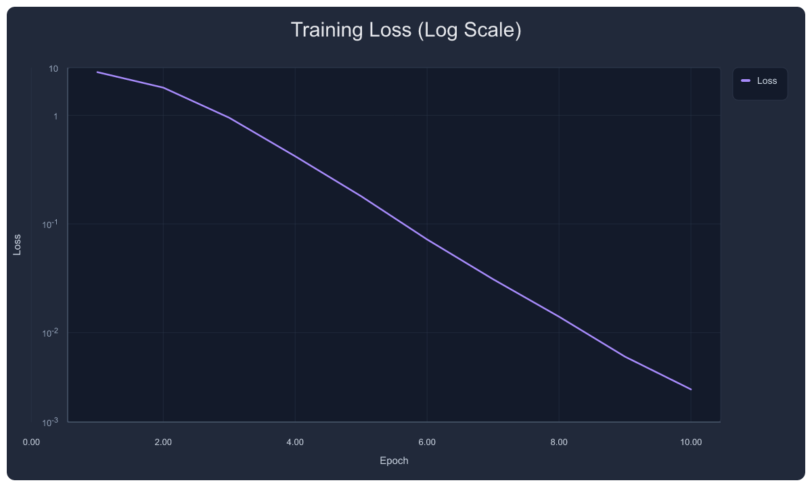

```json
{"tool": "plot_series", "arguments": {
  "title": "Training Loss (Log Scale)",
  "xlabel": "Epoch", "ylabel": "Loss",
  "y_scale": "log",
  "series": [{"name": "Loss", "type": "line", "points": [[1,2.5],[2,1.8],[3,0.95],[4,0.42],[5,0.18],[6,0.072],[7,0.031],[8,0.014],[9,0.006],[10,0.003]], "color": "#a78bfa"}]
}}
```

---

### 17. Scatter with Asymmetric Error Bars

Asymmetric uncertainty — `error: { plus: [...], minus: [...] }`.

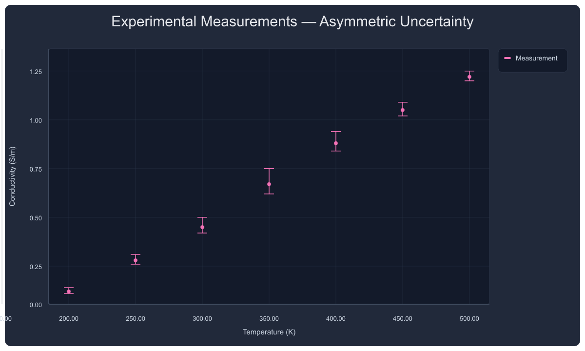

```json
{"tool": "plot_series", "arguments": {
  "title": "Experimental Measurements — Asymmetric Uncertainty",
  "xlabel": "Temperature (K)", "ylabel": "Conductivity (S/m)",
  "series": [{"name": "Measurement", "type": "scatter", "points": [[200,0.12],[250,0.28],[300,0.45],[350,0.67],[400,0.88],[450,1.05],[500,1.22]], "color": "#f472b6", "error": {"plus": [0.02,0.03,0.05,0.08,0.06,0.04,0.03], "minus": [0.01,0.02,0.03,0.05,0.04,0.03,0.02]}}]
}}
```

---

### 18. Transform Pipeline — Raw → Smoothed → Normalized

Three views of the same noisy data: raw scatter, smoothed line (window=3), and min-max normalized.

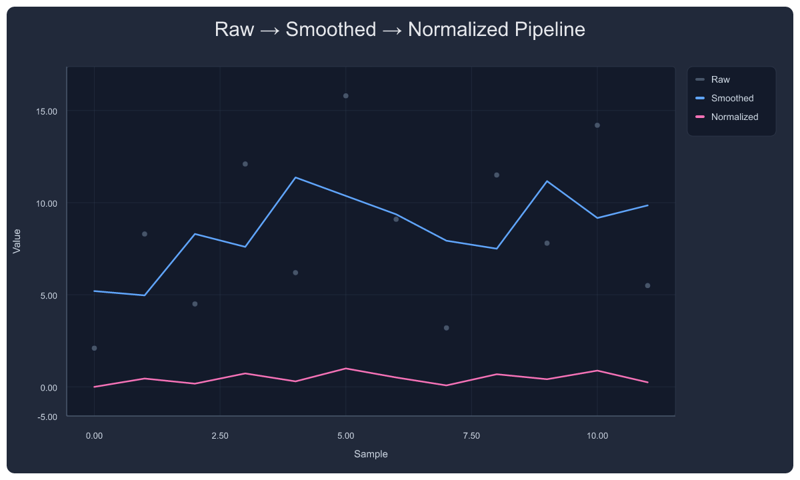

```json
{"tool": "plot_series", "arguments": {
  "title": "Raw → Smoothed → Normalized Pipeline",
  "xlabel": "Sample", "ylabel": "Value",
  "series": [
    {"name": "Raw",        "type": "scatter", "points": [[0,2.1],[1,8.3],[2,4.5],[3,12.1],[4,6.2],[5,15.8],[6,9.1],[7,3.2],[8,11.5],[9,7.8],[10,14.2],[11,5.5]], "color": "#475569"},
    {"name": "Smoothed",   "type": "line",    "points": [[0,2.1],[1,8.3],[2,4.5],[3,12.1],[4,6.2],[5,15.8],[6,9.1],[7,3.2],[8,11.5],[9,7.8],[10,14.2],[11,5.5]], "color": "#60a5fa", "transforms": [{"type": "smooth", "window": 3}]},
    {"name": "Normalized", "type": "line",    "points": [[0,2.1],[1,8.3],[2,4.5],[3,12.1],[4,6.2],[5,15.8],[6,9.1],[7,3.2],[8,11.5],[9,7.8],[10,14.2],[11,5.5]], "color": "#f472b6", "transforms": [{"type": "normalize", "method": "minmax"}]}
  ]
}}
```

---

### 19. 2×2 Subplot Grid

Four different chart types in one figure — line, scatter, function.

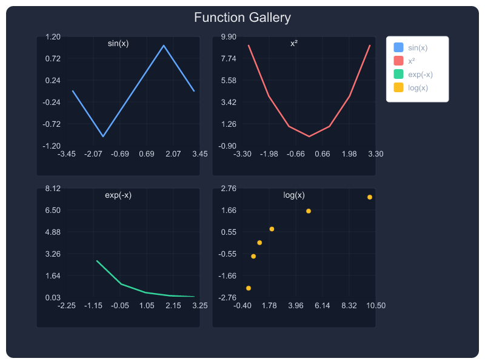

```json
{"tool": "multi_plot", "arguments": {
  "title": "Function Gallery",
  "rows": 2, "cols": 2,
  "plots": [
    {"row": 0, "col": 0, "title": "sin(x)",    "series": [{"type": "line",    "name": "sin(x)",   "points": [[-3.14,0],[-1.57,-1],[0,0],[1.57,1],[3.14,0]],  "color": "#60a5fa"}]},
    {"row": 0, "col": 1, "title": "x²",         "series": [{"type": "line",    "name": "x²",       "points": [[-3,9],[-2,4],[-1,1],[0,0],[1,1],[2,4],[3,9]],   "color": "#f87171"}]},
    {"row": 1, "col": 0, "title": "exp(-x)",    "series": [{"type": "line",    "name": "exp(-x)",  "points": [[-2,7.39],[-1,2.72],[0,1],[1,0.37],[2,0.14]],    "color": "#34d399"}]},
    {"row": 1, "col": 1, "title": "log(x)",     "series": [{"type": "scatter", "name": "log(x)",   "points": [[0.1,-2.3],[0.5,-0.69],[1,0],[2,0.69],[5,1.6]], "color": "#fbbf24"}]}
  ]
}}
```

---

### 20. Teaching Template — Definite Integral

Built-in teaching module: shaded integral region, formula, bounds.

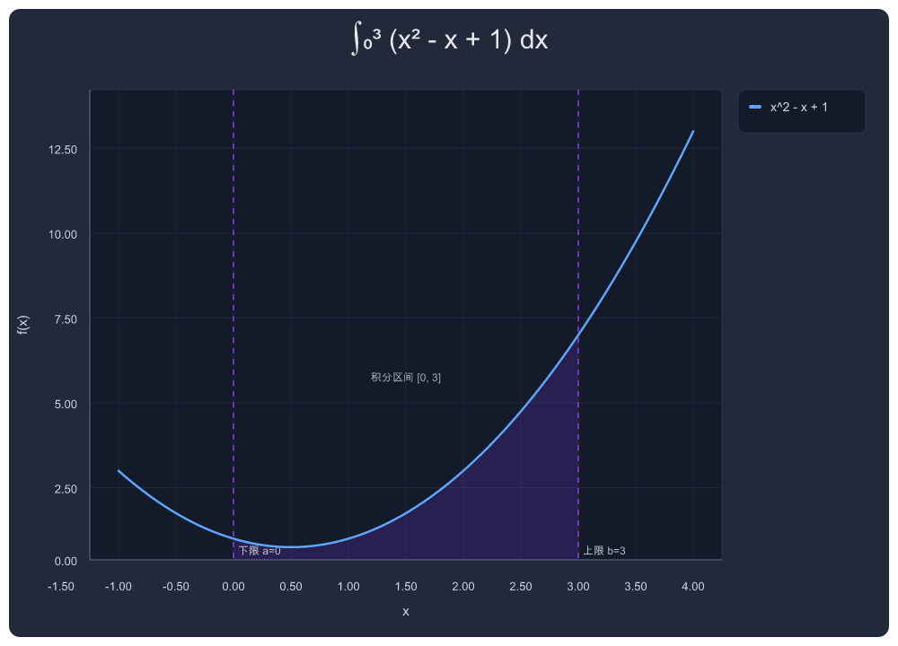

```json
{"tool": "teaching", "arguments": {
  "topic": "definite_integral",
  "params": {"expr": "x^2 - x + 1", "a": 0, "b": 3},
  "title": "∫₀³ (x² - x + 1) dx"
}}
```

---

## Data Transforms

Pipeline transforms on data series:

```json
"transforms": [
  {"type": "smooth", "window": 5},
  {"type": "normalize", "method": "minmax"},
  {"type": "normalize", "method": "zscore"},
  {"type": "rolling_avg", "window": 3}
]
```

Downsampling is automatic for large datasets (minmax algorithm preserves visual extrema).

---

## Error Bars

Three formats:

```json
"error": [2, 3, 2, 1]                          // symmetric per-point
"error": 5                                      // constant for all points
"error": {"plus": [0.02,0.03], "minus": [0.01,0.02]}  // asymmetric
```

---

## Current Strengths & Limits

### What works well
- Dark-theme defaults that look good without configuration
- π-aware trig axes with automatic detection
- Minmax downsampling that preserves visual extrema
- Structured warnings and debug traces for observability
- CJK text via path-based rendering (no client font dependency)
- Asymptote-aware function plotting with IQR bounds clamping
- Annotation system with three semantic types and layered placement

### Current limits
- Annotation local collision avoidance is basic — labels in the same region may overlap. Full layout engine planned for next release.
- Symbolic tick marks beyond π (e.g., √2, e) are not yet auto-detected.
- Function plot layout prioritizes readability over full symbolic analysis.
- Some legacy tools (`plot_bar`, `plot_json`) remain for backward compatibility.

---

## Self-Host (Deploy Your Own)

### Prerequisites

- [Node.js](https://nodejs.org/) 20+
- [Wrangler CLI](https://developers.cloudflare.com/workers/wrangler/) (`npm install -g wrangler`)
- A [Cloudflare](https://dash.cloudflare.com/) account (free tier works)
- Cloudflare Workers KV namespace (for font storage and short-link URLs)

### Steps

```bash
# 1. Clone
git clone https://github.com/lingion/plot-mcp-worker.git
cd plot-mcp-worker

# 2. Install dependencies
npm install

# 3. Create KV namespace
npx wrangler kv namespace create SHORT_LINKS
# Note the `id` from the output

# 4. Update wrangler.toml with your KV namespace ID

# 5. Upload fonts to KV (for CJK support)
#
# CJK text is rendered via text-to-path (opentype.js), embedding font outlines
# directly into SVG. You need a subset font stored in KV:
#   - Use pyftsubset to extract GB2312 + punctuation + math symbols
#   - Add --no-hinting to keep file under 3 MB (wrangler kv put silent-fails above that)
npx wrangler kv key put "font:arial-unicode-cn-gb2312" \
  --namespace-id YOUR_KV_ID --path subset.ttf --remote

# Latin text uses embedded font buffers in the Worker. If you want to override
# the default Latin glyphs, upload a TTF with full ASCII coverage:
npx wrangler kv key put "font:arial-sans" \
  --namespace-id YOUR_KV_ID --path latin-font.ttf --remote

# Note: You are responsible for font licensing when self-hosting.

# 6. Deploy
npx wrangler deploy
```

### Custom Domain (Optional)

Add a route in `wrangler.toml`:

```toml
[[routes]]
pattern = "plot.yourdomain.com/*"
zone_name = "yourdomain.com"
```

---

## Architecture

```
Client (AI agent)
    │
    ▼
┌─────────────────────────────┐
│   Cloudflare Worker         │
│                             │
│  MCP endpoint (/mcp)        │◄── JSON-RPC tool calls
│         │                   │
│         ▼                   │
│  Spec normalization         │    Input → PlotSpec
│         │                   │
│         ▼                   │
│  SVG generation             │    Pure string templates
│         │                   │
│         ▼                   │
│  CJK text-to-path           │    opentype.js (font from KV)
│         │                   │
│         ▼                   │
│  PNG rasterization          │    resvg-wasm
│         │                   │
│         ▼                   │
│  KV short-link storage      │    5-min TTL
│                             │
└─────────────────────────────┘
    │
    ▼
  PNG URL → client
```

No headless browser. No external storage. Everything runs in a single Cloudflare Worker with KV.

### Bundle & Asset Sizes

- Worker bundle: roughly ~1 MB gzipped (well within CF free tier 3 MB limit)
- CJK font subset size depends on chosen font assets; stored in KV and cached in Worker memory

---

## MCP Tools Reference

### Recommended

| Tool | Description | Key Parameters |
|------|-------------|----------------|
| `plot` / `plot_png_link` | Single expression chart | `expr`, `title`, `x_min`, `x_max`, `annotations` |
| `plot_multi` | Multiple expressions overlaid | `exprs[]`, `labels[]`, `title` |
| `plot_series` | Data-driven charts | `series[]` with `type`, `points`, `color`, `error`, `transforms` |
| `multi_plot` | Subplot grid | `rows`, `cols`, `plots[]` |

### Legacy / Specialized

| Tool | Description |
|------|-------------|
| `plot_bar` | Quick bar chart (categories + values) |
| `teaching` | Math education templates: `definite_integral`, `derivative_tangent`, `fourier_series`, `projectile`, `simple_harmonic`, `energy_conservation`, `rc_circuit`, `parabola` |
| `analysis` | Statistical analysis: `describe`, `corr`, `groupby` |
| `force_diagram_link` | Physics force diagrams |
| `circuit_diagram_link` | Circuit schematics |
| `venn_diagram_link` | Venn diagrams |
| `c_memory_diagram_link` | C memory layout |
| `plot_json` | Raw spec input (advanced) |

---

## License

MIT
