# plot-mcp-worker

[English](README.md)

运行在 Cloudflare Workers 上的无服务器图表渲染引擎。通过 MCP 协议暴露端点，让任何 AI Agent 通过一条 JSON 调用即可生成 PNG/SVG 图表——无需无头浏览器、无需服务器、无需存储桶。

SVG 渲染后通过 [resvg-wasm](https://github.com/nicbarker/resvg-js) 栅格化为 PNG。中文文字（GB2312 + 标点 + 数学符号，7500+ 字形）通过 opentype.js 文字转路径管线直接嵌入 SVG，不依赖客户端字体。

**在线端点：** `https://plot-mcp.qdp.qzz.io/mcp`

---

## 快速开始

### 接入 MCP 客户端

添加到 MCP 客户端配置（Claude Desktop、Cursor 等）：

```json
{
  "mcpServers": {
    "plot": {
      "url": "https://plot-mcp.qdp.qzz.io/mcp"
    }
  }
}
```

无需 API Key。你的 AI Agent 即可直接生成图表。

> **合理使用：** 公共端点供实验和集成测试使用。生产环境或高流量场景建议[自部署](#自部署)。

### HTTP 调用

```bash
curl -X POST https://plot-mcp.qdp.qzz.io/mcp \
  -H "Content-Type: application/json" \
  -d '{
    "jsonrpc": "2.0", "id": 1,
    "method": "tools/call",
    "params": {
      "name": "plot_png_link",
      "arguments": {"expr": "sin(x)", "title": "正弦波"}
    }
  }'
```

返回 JSON 包含 `png_url`。预渲染 PNG，5 分钟缓存。

### 直接 PNG/SVG URL

```
https://plot-mcp.qdp.qzz.io/png?d=<base64url 编码参数>
https://plot-mcp.qdp.qzz.io/plot?d=<base64url 编码参数>
```

通过 `plot_png_link` 或 `plot` 工具获取编码后的 URL。

---

## 推荐工具

**从这里开始。** 这四个工具覆盖 95% 的使用场景：

| 工具 | 用途 |
|------|------|
| **`plot`** / **`plot_png_link`** | 单函数/表达式——`sin(x)`、`exp(-x)*cos(x)` 等。支持标注、自定义范围、布局预设。 |
| **`plot_multi`** | 多表达式叠加——对比函数、展示分解。 |
| **`plot_series`** | 数据驱动图表——折线、散点、柱状（分组/堆叠）、直方图、箱线图、饼图。接受原始数据数组，支持误差棒和变换。 |
| **`multi_plot`** | 子图网格——M×N 布局，每个子图可以是任意图表类型。 |

### 旧版 / 专用工具

以下工具为兼容性和特定场景保留。新集成优先使用上方四个推荐工具。

| 工具 | 用途 |
|------|------|
| `plot_bar` | 快速柱状图（类别 + 值） |
| `teaching` | 内置数学教学模板（定积分、导数切线、傅里叶、抛体运动等） |
| `analysis` | 统计分析——描述、相关、分组 |
| `force_diagram_link` | 物理力学图 |
| `circuit_diagram_link` | 电路示意图 |
| `venn_diagram_link` | 韦恩图 |
| `c_memory_diagram_link` | C 语言内存布局 |
| `plot_json` | 原始 spec 输入（高级） |

---

## 智能默认值

引擎在你触碰任何选项之前已经做了很多事：

### 坐标轴智能
- **Nice ticks**：步长从 1、2、2.5、5 × 10ⁿ 中选取——不会出现 0.72 或 1.2 这样的丑值
- **自动 π 模式**：三角函数自动获得 π 格式 x 轴（`-2π, -π, 0, π, 2π`）
- **三角 y 特殊**：sin/cos 获得刻度 `[-1, -0.5, 0, 0.5, 1]` 而非任意小数
- **零对称**：数学风格函数图默认 y 轴关于零对称
- **对数刻度**：设置 `y_scale: "log"` 启用对数 y 轴

### 不连续处理
- **渐近线检测**：符号翻转 + 大 Δy 触发路径断开——渐近线处不会出现垂直刺
- **IQR 裁剪**：渐近线附近的极端值（如 tan(x) 在 ±π/2 处）通过四分位距过滤自动裁剪，保持 y 轴可读

### 视觉设计
- **默认暗色主题**：`#0f172a` 卡片、`#111827` 绘图区、`#334155` 网格——开箱即用
- **图例在绘图区外**：右侧预留，永远不遮挡数据
- **画布预设**：Math（1000×720）用于函数图，Report（1200×720）用于数据图表
- **中文支持**：7500+ 字形（GB2312 + 标点 + 数学符号）通过文字转路径管线
- **调色板**：`#60a5fa, #f87171, #34d399, #fbbf24, #a78bfa, #22d3ee, #fb923c, #f472b6`

### 标注系统

三种标注类型，分层放置：

```json
"annotations": [
  {"kind": "point", "x": 1.471, "y": 0.859, "label": "峰值", "color": "#fbbf24"},
  {"kind": "area", "x_min": 0.8, "x_max": 2.2, "label": "区域", "color": "#60a5fa", "opacity": 0.12},
  {"kind": "vertical_line", "x": 6.93, "label": "半衰期", "color": "#f87171"}
]
```

布局规则：点标注 → 标记右上方；区域标注 → 区域内部偏下；垂直线标注 → 绘图区底部。当前版本的局部碰撞避让较为基础，后续版本将改进。

### 表达式语法

基于 [expr-eval](https://github.com/silentmatt/expr-eval)：

- 函数：`sin`、`cos`、`tan`、`exp`、`log`、`sqrt`、`abs`、`floor`、`ceil`、`round`
- 常量：`pi`、`e`
- 运算符：`+`、`-`、`*`、`/`、`^`（幂）、`%`（取模）

---

## 返回格式

### PNG 链接（plot、plot_multi、plot_series、multi_plot）

```json
{
  "ok": true,
  "png_url": "https://plot-mcp.qdp.qzz.io/png?d=...",
  "warnings": []
}
```

### 调试模式（debug: true）

```json
{
  "ok": true,
  "spec": { "xMin": -6.28, "xMax": 6.28, "yMin": -1.2, "yMax": 1.2 },
  "warnings": [{"type": "bounds", "message": "y-range clamped via IQR outlier removal"}],
  "debug": {
    "stages": [
      {"name": "raw", "input": 400, "output": 400},
      {"name": "downsample", "method": "minmax", "input": 400, "output": 200}
    ]
  }
}
```

### 错误

```json
{
  "ok": false,
  "error": {
    "type": "transform",
    "message": "normalize skipped due to error bars"
  }
}
```

---

## 可观测性与安全

引擎不只是画图——它会解释自己做了什么，并在可能有问题时发出警告。

### 调试模式

```json
{"tool": "plot_series", "arguments": {
  "debug": true,
  "series": [{"type": "line", "name": "data", "points": [[1,2],[2,5],[3,3]]}]
}}
```

返回 `debug` 对象，包含管线各阶段：

```json
{
  "debug": {
    "stages": [
      {"name": "raw", "input": 3, "output": 3},
      {"name": "downsample", "method": "minmax", "input": 3, "output": 3}
    ]
  }
}
```

### 结构化警告

引擎在做出自动决策时发出警告：

```json
{
  "warnings": [
    {"type": "transform", "message": "normalize skipped due to error bars"},
    {"type": "bounds", "message": "y-range clamped via IQR outlier removal (42 of 400 points excluded)"}
  ]
}
```

### 变换策略

控制引擎应用自动变换的激进程度：

```json
"transformPolicy": "strict"       // 不支持的变换直接报错
"transformPolicy": "best-effort"  // 静默跳过（默认）
```

---

## Showcase

### 1. 三角函数组合

sin、cos 及其叠加——自动检测 π 模式 x 轴、三角 y 特殊刻度。

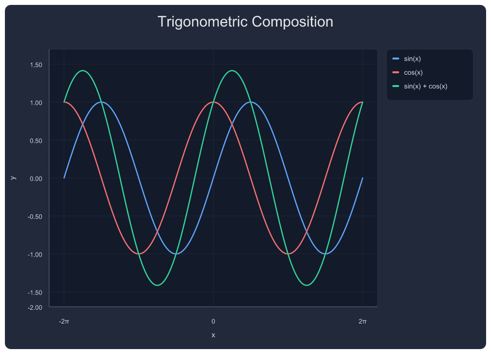

```json
{"tool": "plot_multi", "arguments": {
  "exprs": ["sin(x)", "cos(x)", "sin(x)+cos(x)"],
  "labels": ["sin(x)", "cos(x)", "sin(x) + cos(x)"],
  "x_min": -6.283, "x_max": 6.283,
  "title": "三角函数组合"
}}
```

---

### 2. 方波——傅里叶级数逼近

逐项添加奇次谐波逼近方波。4 条曲线，自动 π 轴。

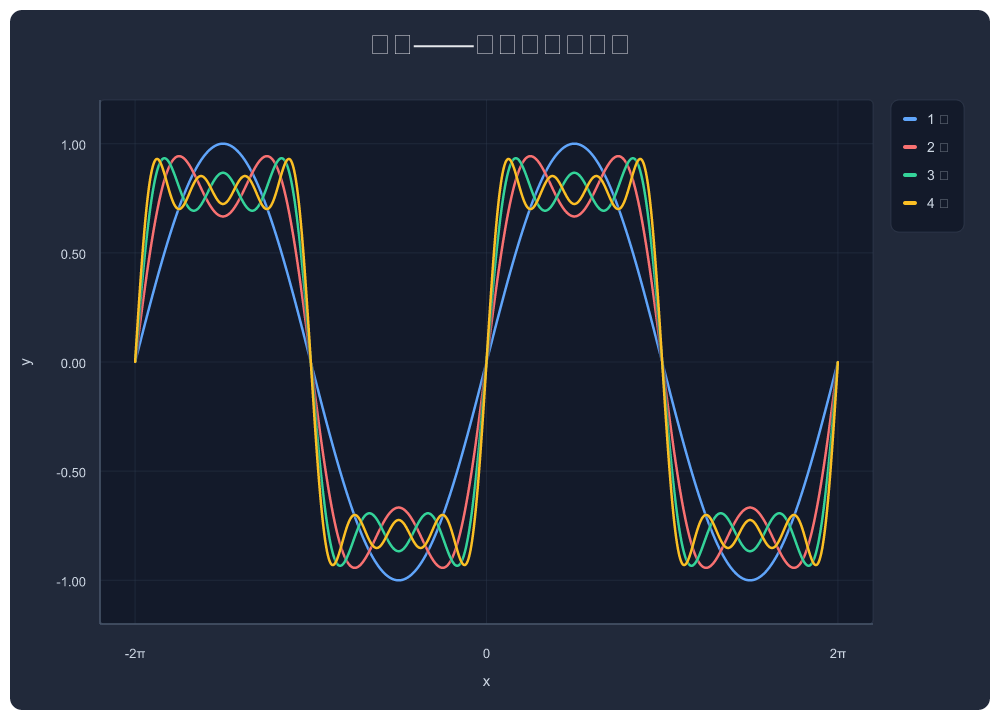

```json
{"tool": "plot_multi", "arguments": {
  "exprs": ["sin(x)", "sin(x)+sin(3*x)/3", "sin(x)+sin(3*x)/3+sin(5*x)/5", "sin(x)+sin(3*x)/3+sin(5*x)/5+sin(7*x)/7"],
  "labels": ["1 项", "2 项", "3 项", "4 项"],
  "x_min": -6.283, "x_max": 6.283,
  "title": "方波——傅里叶级数逼近"
}}
```

---

### 3. tan(x)——渐近线感知渲染

自动不连续检测 + IQR 裁剪。无尖刺，无连接 ±∞ 的垂直线。渐近线附近 y 轴保持可读。

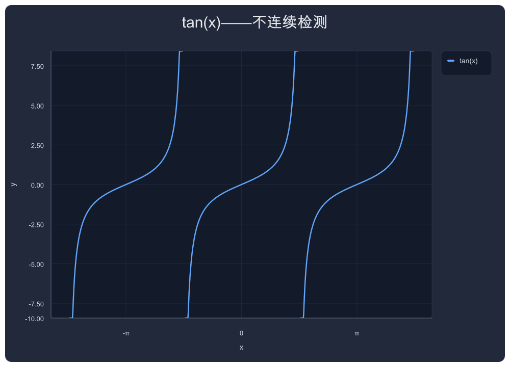

```json
{"tool": "plot_png_link", "arguments": {
  "expr": "tan(x)",
  "x_min": -4.712, "x_max": 4.712,
  "title": "tan(x)——不连续检测"
}}
```

---

### 4. sinc(x) = sin(x)/x

x=0 处可去奇点处理。

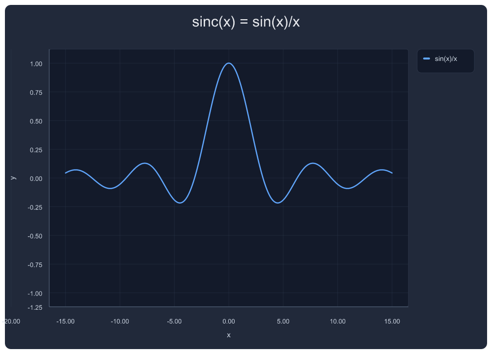

```json
{"tool": "plot_png_link", "arguments": {
  "expr": "sin(x)/x",
  "x_min": -15, "x_max": 15,
  "title": "sinc(x) = sin(x)/x"
}}
```

---

### 5. 1/(x²-1)——有理函数 + 渐近线标注

x = ±1 处的垂直渐近线标记。极点间隙无伪影。

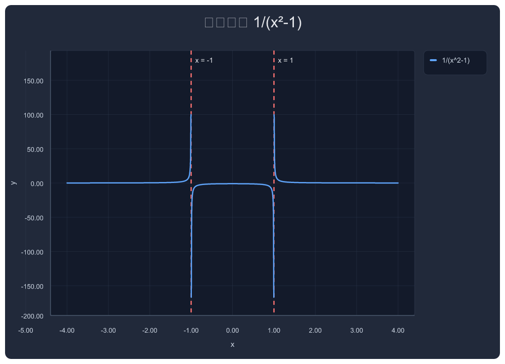

```json
{"tool": "plot_png_link", "arguments": {
  "expr": "1/(x^2-1)",
  "x_min": -4, "x_max": 4,
  "title": "1/(x²-1)——有理函数",
  "annotations": [
    {"kind": "vertical_line", "x": -1, "label": "x = -1", "color": "#f87171"},
    {"kind": "vertical_line", "x":  1, "label": "x = 1",  "color": "#f87171"}
  ]
}}
```

---

### 6. 阻尼振荡

指数衰减 × 三角——自动 nice ticks，15 个单位区间平滑渲染。

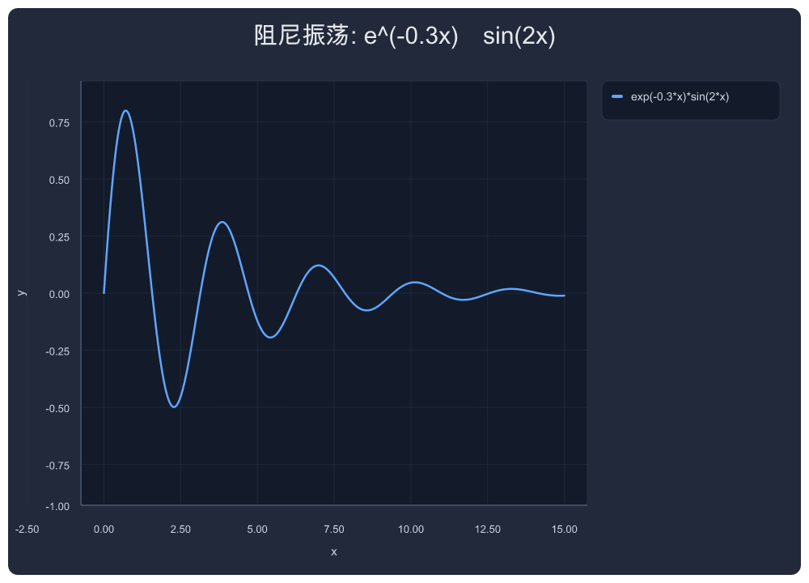

```json
{"tool": "plot_png_link", "arguments": {
  "expr": "exp(-0.3*x)*sin(2*x)",
  "x_min": 0, "x_max": 15,
  "title": "阻尼振荡：e^(-0.3x)·sin(2x)"
}}
```

---

### 7. |sin(x)|·cos(x)——整流乘积

绝对值组合——非平凡波形，含符号变化。

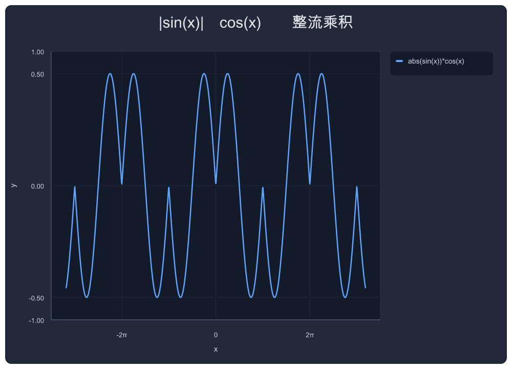

```json
{"tool": "plot_png_link", "arguments": {
  "expr": "abs(sin(x))*cos(x)",
  "x_min": -10, "x_max": 10,
  "title": "|sin(x)|·cos(x)——整流乘积"
}}
```

---

### 8. 高斯混合模型

三个不同均值和方差的高斯分布。

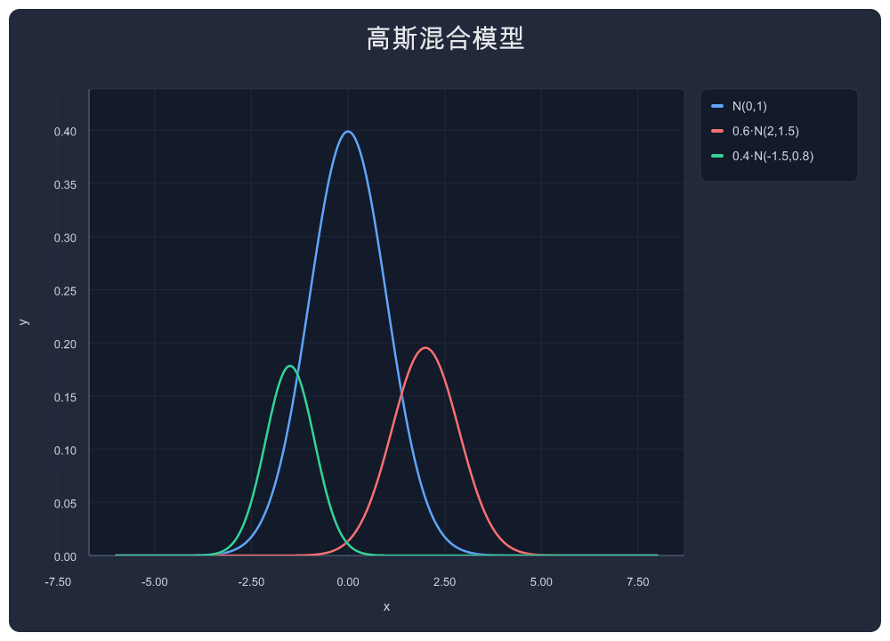

```json
{"tool": "plot_multi", "arguments": {
  "exprs": ["exp(-x*x/2)/sqrt(2*3.14159)", "0.6*exp(-(x-2)*(x-2)/1.5)/sqrt(2*3.14159*1.5)", "0.4*exp(-(x+1.5)*(x+1.5)/0.8)/sqrt(2*3.14159*0.8)"],
  "labels": ["N(0,1)", "0.6·N(2,1.5)", "0.4·N(-1.5,0.8)"],
  "x_min": -6, "x_max": 8,
  "title": "高斯混合模型"
}}
```

---

### 9. 衰减正弦 + 全标注

区域着色、点标记、垂直线——所有标注类型在同一张图中。点标注位于数学正确的峰值位置（由 f'(x)=0 求解）。标注使用分层布局：点在右上方、区域在内部偏下、垂直线在底部。

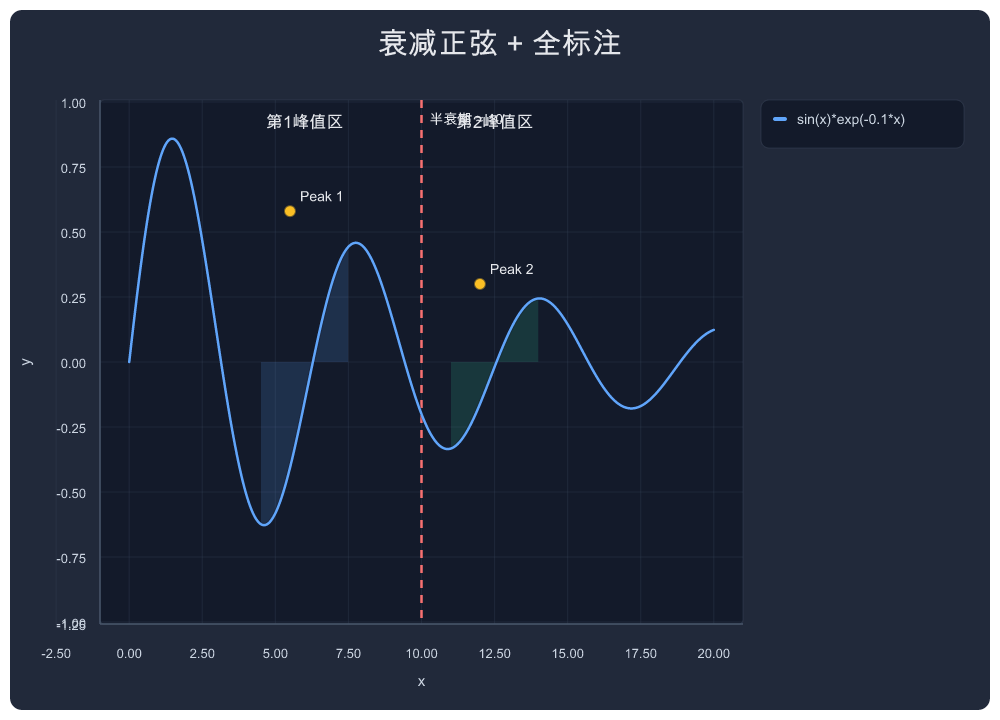

```json
{"tool": "plot_png_link", "arguments": {
  "expr": "sin(x)*exp(-0.1*x)",
  "x_min": 0, "x_max": 20,
  "title": "衰减正弦 + 全标注",
  "annotations": [
    {"kind": "area", "x_min": 0.8, "x_max": 2.2, "label": "第1峰值区", "color": "#60a5fa", "opacity": 0.12},
    {"kind": "area", "x_min": 7.0, "x_max": 8.5, "label": "第2峰值区", "color": "#34d399", "opacity": 0.12},
    {"kind": "point", "x": 1.471, "y": 0.859, "label": "峰值 1", "color": "#fbbf24"},
    {"kind": "point", "x": 7.754, "y": 0.458, "label": "峰值 2", "color": "#fbbf24"},
    {"kind": "vertical_line", "x": 6.93, "label": "半衰期 ≈ 6.93", "color": "#f87171"}
  ]
}}
```

---

### 10. 多系列商务图 + 误差棒

预测 vs 实际 vs 目标——散点图上的对称误差棒。

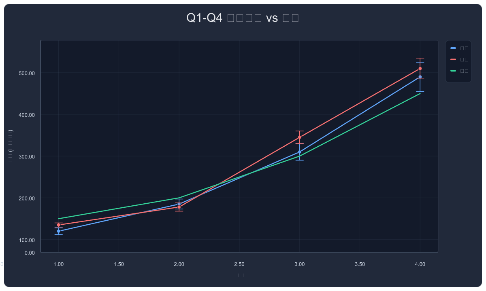

```json
{"tool": "plot_series", "arguments": {
  "title": "Q1-Q4 营收预测 vs 实际",
  "xlabel": "季度", "ylabel": "营收（百万美元）",
  "series": [
    {"name": "预测", "type": "line+scatter", "points": [[1,120],[2,185],[3,310],[4,490]], "color": "#60a5fa", "error": [8,12,20,35]},
    {"name": "实际", "type": "line+scatter", "points": [[1,135],[2,178],[3,345],[4,510]], "color": "#f87171", "error": [5,10,15,25]},
    {"name": "目标", "type": "line",         "points": [[1,150],[2,200],[3,300],[4,450]], "color": "#34d399"}
  ]
}}
```

---

### 11. 分组柱状图 + 误差棒

3 个模型 × 4 项测试——每根柱子的误差棒，自动类别标签。

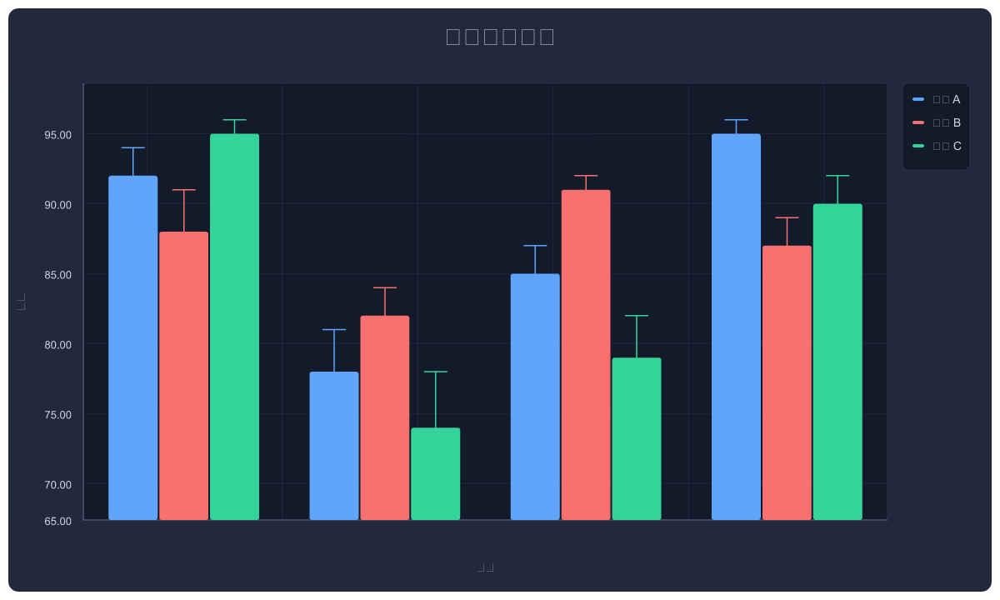

```json
{"tool": "plot_series", "arguments": {
  "title": "性能基准测试",
  "xlabel": "测试", "ylabel": "分数",
  "bar_style": "grouped",
  "series": [
    {"name": "模型 A", "type": "bar", "points": [[0,92],[1,78],[2,85],[3,95]], "group": "g", "color": "#60a5fa", "error": [2,3,2,1]},
    {"name": "模型 B", "type": "bar", "points": [[0,88],[1,82],[2,91],[3,87]], "group": "g", "color": "#f87171", "error": [3,2,1,2]},
    {"name": "模型 C", "type": "bar", "points": [[0,95],[1,74],[2,79],[3,90]], "group": "g", "color": "#34d399", "error": [1,4,3,2]}
  ]
}}
```

---

### 12. 堆叠柱状图

云基础设施成本分解——计算、存储、网络按月堆叠。

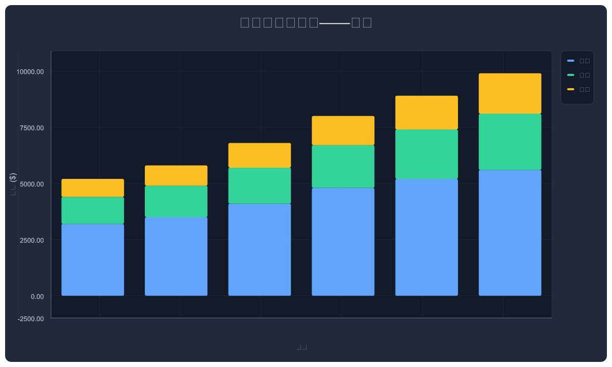

```json
{"tool": "plot_series", "arguments": {
  "title": "云基础设施成本——堆叠",
  "xlabel": "月份", "ylabel": "成本（美元）",
  "bar_style": "stacked",
  "series": [
    {"name": "计算", "type": "bar", "points": [[1,3200],[2,3500],[3,4100],[4,4800],[5,5200],[6,5600]], "group": "g", "color": "#60a5fa"},
    {"name": "存储", "type": "bar", "points": [[1,1200],[2,1400],[3,1600],[4,1900],[5,2200],[6,2500]], "group": "g", "color": "#34d399"},
    {"name": "网络", "type": "bar", "points": [[1,800],[2,900],[3,1100],[4,1300],[5,1500],[6,1800]], "group": "g", "color": "#fbbf24"}
  ]
}}
```

---

### 13. 饼图

团队时间分配，带百分比标签。

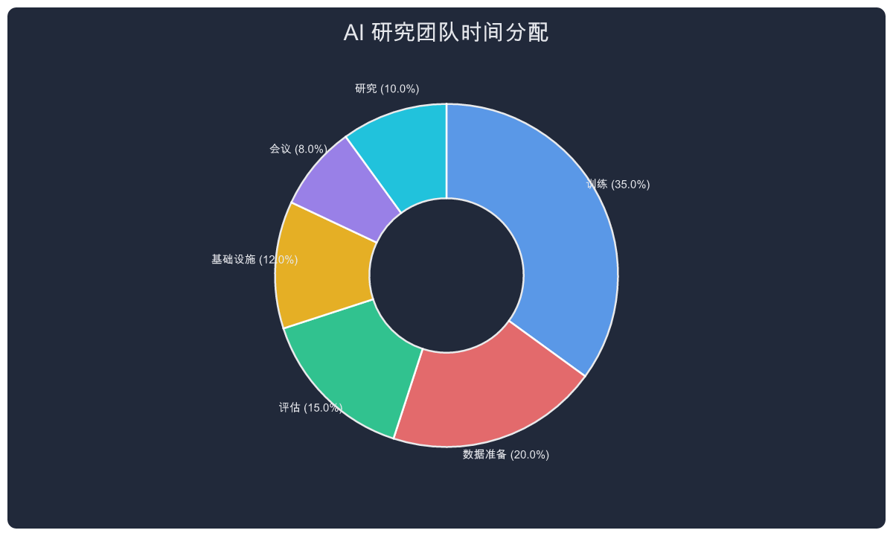

```json
{"tool": "plot_series", "arguments": {
  "title": "AI 研究团队时间分配",
  "series": [{"type": "pie", "name": "team", "labels": ["训练","数据准备","评估","基础设施","会议","研究"], "values": [35,20,15,12,8,10]}]
}}
```

---

### 14. 直方图

响应延迟分布，自动分箱。

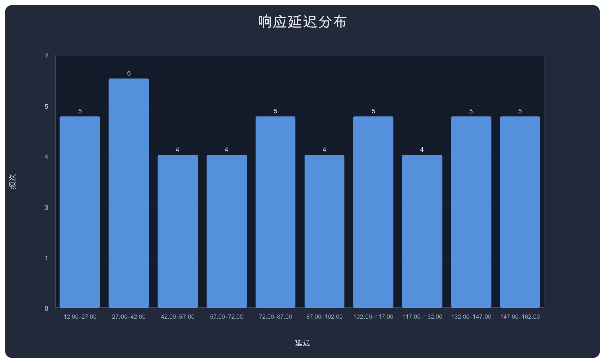

```json
{"tool": "plot_series", "arguments": {
  "title": "响应延迟分布",
  "xlabel": "延迟", "ylabel": "计数",
  "series": [{"type": "hist", "name": "latency", "data": [12,15,18,22,25,28,30,32,35,38,41,45,48,52,55,58,62,65,68,72,75,78,82,85,88,92,95,98,102,105,108,112,115,118,122,125,128,132,135,138,142,145,148,152,155,158,162], "bins": 10}]
}}
```

---

### 15. 箱线图

模型精度对比——中位数、四分位、须、离群值。

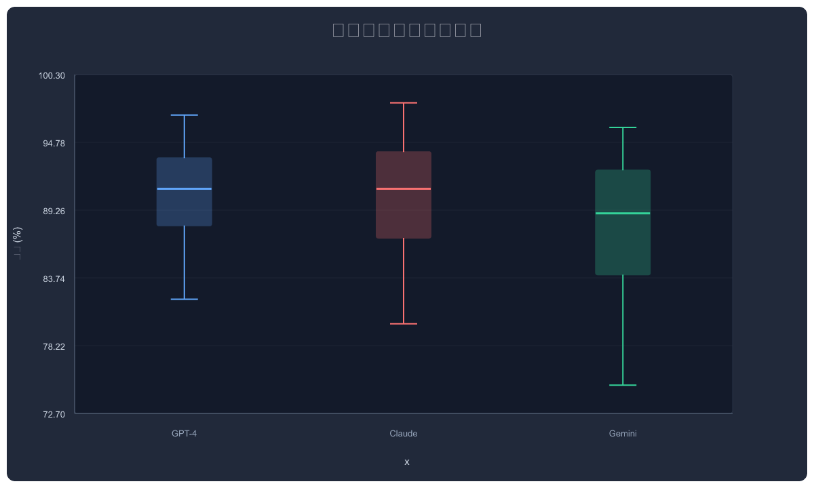

```json
{"tool": "plot_series", "arguments": {
  "title": "各数据集模型精度",
  "ylabel": "精度（%）",
  "series": [
    {"type": "box", "name": "GPT-4",  "data": [82,85,87,89,90,91,92,93,94,95,97]},
    {"type": "box", "name": "Claude", "data": [80,84,86,88,90,91,92,93,95,96,98]},
    {"type": "box", "name": "Gemini", "data": [75,79,83,85,87,89,90,92,93,94,96]}
  ]
}}
```

---

### 16. 对数刻度

10 轮训练损失——y 轴自动切换对数刻度格式。

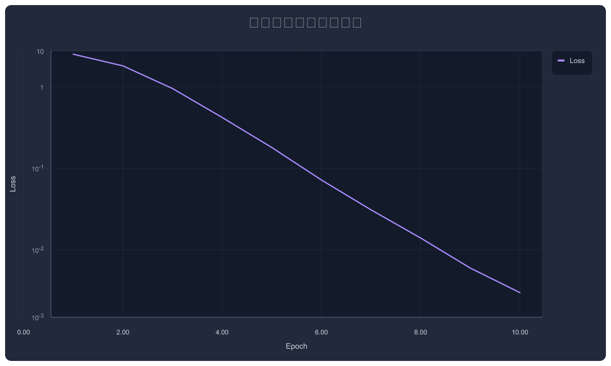

```json
{"tool": "plot_series", "arguments": {
  "title": "训练损失（对数刻度）",
  "xlabel": "轮次", "ylabel": "损失",
  "y_scale": "log",
  "series": [{"name": "损失", "type": "line", "points": [[1,2.5],[2,1.8],[3,0.95],[4,0.42],[5,0.18],[6,0.072],[7,0.031],[8,0.014],[9,0.006],[10,0.003]], "color": "#a78bfa"}]
}}
```

---

### 17. 散点图 + 非对称误差棒

非对称不确定性——`error: { plus: [...], minus: [...] }`。

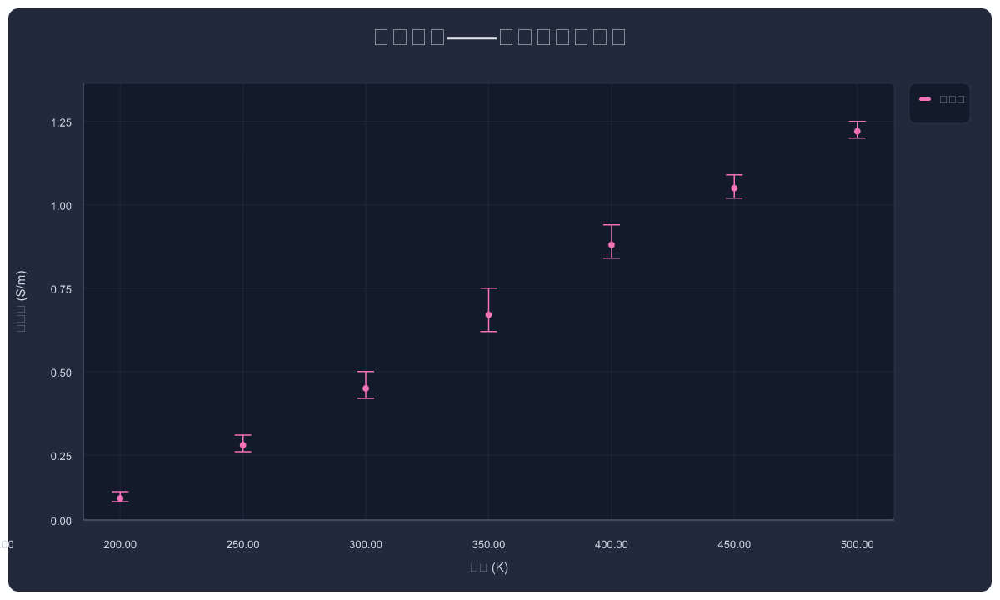

```json
{"tool": "plot_series", "arguments": {
  "title": "实验测量——非对称不确定性",
  "xlabel": "温度 (K)", "ylabel": "电导率 (S/m)",
  "series": [{"name": "测量值", "type": "scatter", "points": [[200,0.12],[250,0.28],[300,0.45],[350,0.67],[400,0.88],[450,1.05],[500,1.22]], "color": "#f472b6", "error": {"plus": [0.02,0.03,0.05,0.08,0.06,0.04,0.03], "minus": [0.01,0.02,0.03,0.05,0.04,0.03,0.02]}}]
}}
```

---

### 18. 变换管线——原始→平滑→归一化

同一组噪声数据的三种视图：原始散点、平滑折线（窗口=3）、min-max 归一化。

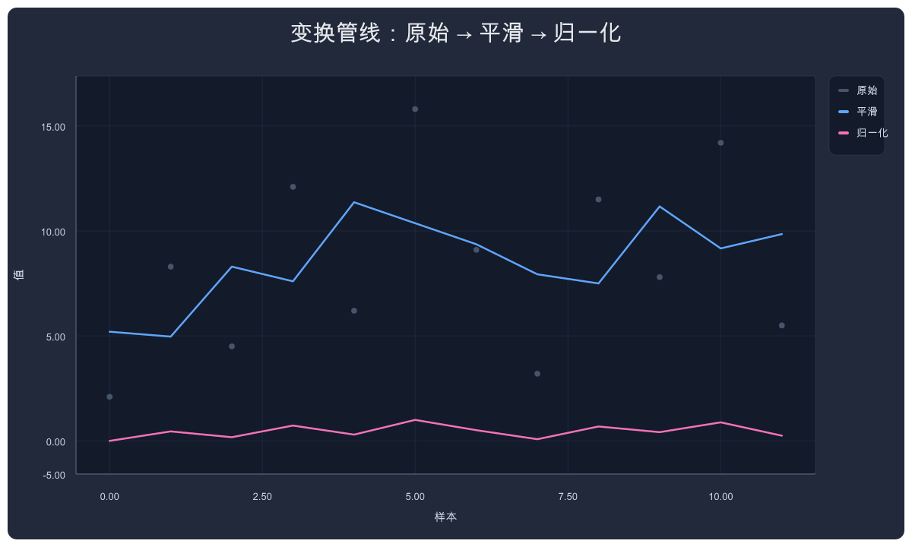

```json
{"tool": "plot_series", "arguments": {
  "title": "原始 → 平滑 → 归一化管线",
  "xlabel": "样本", "ylabel": "值",
  "series": [
    {"name": "原始",   "type": "scatter", "points": [[0,2.1],[1,8.3],[2,4.5],[3,12.1],[4,6.2],[5,15.8],[6,9.1],[7,3.2],[8,11.5],[9,7.8],[10,14.2],[11,5.5]], "color": "#475569"},
    {"name": "平滑",   "type": "line",    "points": [[0,2.1],[1,8.3],[2,4.5],[3,12.1],[4,6.2],[5,15.8],[6,9.1],[7,3.2],[8,11.5],[9,7.8],[10,14.2],[11,5.5]], "color": "#60a5fa", "transforms": [{"type": "smooth", "window": 3}]},
    {"name": "归一化", "type": "line",    "points": [[0,2.1],[1,8.3],[2,4.5],[3,12.1],[4,6.2],[5,15.8],[6,9.1],[7,3.2],[8,11.5],[9,7.8],[10,14.2],[11,5.5]], "color": "#f472b6", "transforms": [{"type": "normalize", "method": "minmax"}]}
  ]
}}
```

---

### 19. 2×2 子图网格

一张图内四种不同图表类型——折线、散点、函数。

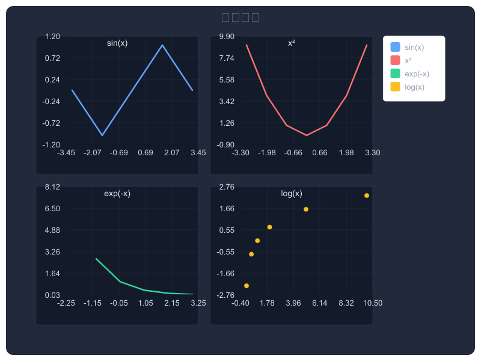

```json
{"tool": "multi_plot", "arguments": {
  "title": "函数画廊",
  "rows": 2, "cols": 2,
  "plots": [
    {"row": 0, "col": 0, "title": "sin(x)",    "series": [{"type": "line",    "name": "sin(x)",   "points": [[-3.14,0],[-1.57,-1],[0,0],[1.57,1],[3.14,0]],  "color": "#60a5fa"}]},
    {"row": 0, "col": 1, "title": "x²",         "series": [{"type": "line",    "name": "x²",       "points": [[-3,9],[-2,4],[-1,1],[0,0],[1,1],[2,4],[3,9]],   "color": "#f87171"}]},
    {"row": 1, "col": 0, "title": "exp(-x)",    "series": [{"type": "line",    "name": "exp(-x)",  "points": [[-2,7.39],[-1,2.72],[0,1],[1,0.37],[2,0.14]],    "color": "#34d399"}]},
    {"row": 1, "col": 1, "title": "log(x)",     "series": [{"type": "scatter", "name": "log(x)",   "points": [[0.1,-2.3],[0.5,-0.69],[1,0],[2,0.69],[5,1.6]], "color": "#fbbf24"}]}
  ]
}}
```

---

### 20. 教学模板——定积分

内置教学模块：积分区域着色、公式、积分限。

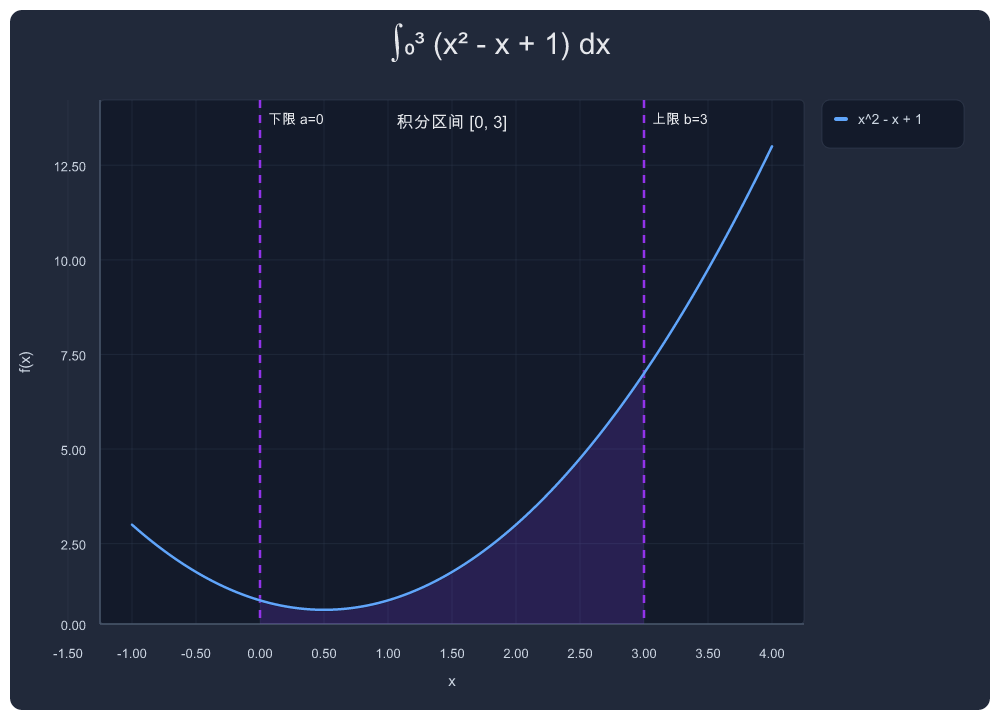

```json
{"tool": "teaching", "arguments": {
  "topic": "definite_integral",
  "params": {"expr": "x^2 - x + 1", "a": 0, "b": 3},
  "title": "∫₀³ (x² - x + 1) dx"
}}
```

---

## 数据变换

数据系列的管线变换：

```json
"transforms": [
  {"type": "smooth", "window": 5},
  {"type": "normalize", "method": "minmax"},
  {"type": "normalize", "method": "zscore"},
  {"type": "rolling_avg", "window": 3}
]
```

大数据集自动降采样（minmax 算法保留视觉极值）。

---

## 误差棒

三种格式：

```json
"error": [2, 3, 2, 1]                          // 对称逐点
"error": 5                                      // 全局常数
"error": {"plus": [0.02,0.03], "minus": [0.01,0.02]}  // 非对称
```

---

## 当前能力与限制

### 擅长的
- 暗色主题默认值，不配置就好看
- π 感知三角轴，自动检测
- Minmax 降采样保留视觉极值
- 结构化警告和调试追踪
- 中文文字通过路径渲染（不依赖客户端字体）
- 渐近线感知的函数绘图 + IQR 裁剪
- 三种语义标注类型 + 分层布局

### 当前限制
- 标注局部碰撞避让较基础——同一区域内的标签可能重叠。完整布局引擎计划在下个版本实现。
- 超越 π 的符号刻度（如 √2、e）尚未自动检测。
- 函数图布局优先保证可读性，而非完整符号分析。
- 部分旧版工具（`plot_bar`、`plot_json`）为向后兼容而保留。

---

## 自部署

### 前提条件

- [Node.js](https://nodejs.org/) 20+
- [Wrangler CLI](https://developers.cloudflare.com/workers/wrangler/)（`npm install -g wrangler`）
- [Cloudflare](https://dash.cloudflare.com/) 账号（免费版即可）
- Cloudflare Workers KV 命名空间（用于字体存储和短链接）

### 步骤

```bash
# 1. 克隆
git clone https://github.com/lingion/plot-mcp-worker.git
cd plot-mcp-worker

# 2. 安装依赖
npm install

# 3. 创建 KV 命名空间
npx wrangler kv namespace create SHORT_LINKS
# 记下输出中的 `id`

# 4. 在 wrangler.toml 中填入 KV 命名空间 ID

# 5. 上传字体到 KV（中文支持）
#
# 中文文字通过 text-to-path（opentype.js）渲染，将字体轮廓直接嵌入 SVG。
# 需要一个子集字体存储在 KV 中：
#   - 使用 pyftsubset 提取 GB2312 + 标点 + 数学符号
#   - 加 --no-hinting 保持文件在 3 MB 以下（wrangler kv put 超过 3 MB 会静默失败）
npx wrangler kv key put "font:arial-unicode-cn-gb2312" \
  --namespace-id YOUR_KV_ID --path subset.ttf --remote

# 拉丁文字使用 Worker 内嵌的字体缓冲区。如需覆盖默认拉丁字形，
# 上传一个包含完整 ASCII 覆盖的 TTF：
npx wrangler kv key put "font:arial-sans" \
  --namespace-id YOUR_KV_ID --path latin-font.ttf --remote

# 注意：自部署时字体授权由你自行负责。

# 6. 部署
npx wrangler deploy
```

### 自定义域名（可选）

在 `wrangler.toml` 中添加路由：

```toml
[[routes]]
pattern = "plot.yourdomain.com/*"
zone_name = "yourdomain.com"
```

---

## 架构

```
客户端（AI Agent）
    │
    ▼
┌─────────────────────────────┐
│   Cloudflare Worker         │
│                             │
│  MCP 端点 (/mcp)            │◄── JSON-RPC 工具调用
│         │                   │
│         ▼                   │
│  Spec 规范化                │    输入 → PlotSpec
│         │                   │
│         ▼                   │
│  SVG 生成                   │    纯字符串模板
│         │                   │
│         ▼                   │
│  中文文字转路径              │    opentype.js（字体来自 KV）
│         │                   │
│         ▼                   │
│  PNG 栅格化                 │    resvg-wasm
│         │                   │
│         ▼                   │
│  KV 短链接存储              │    5 分钟 TTL
│                             │
└─────────────────────────────┘
    │
    ▼
  PNG URL → 客户端
```

无无头浏览器。无外部存储。一切运行在单个 Cloudflare Worker + KV 中。

### 包与资源大小

- Worker 包：约 ~1 MB gzipped（远低于 CF 免费版 3 MB 限制）
- 中文子集字体大小取决于所选字体资源；存储在 KV 中，缓存在 Worker 内存

---

## MCP 工具参考

### 推荐

| 工具 | 说明 | 关键参数 |
|------|------|----------|
| `plot` / `plot_png_link` | 单表达式图表 | `expr`、`title`、`x_min`、`x_max`、`annotations` |
| `plot_multi` | 多表达式叠加 | `exprs[]`、`labels[]`、`title` |
| `plot_series` | 数据驱动图表 | `series[]` 含 `type`、`points`、`color`、`error`、`transforms` |
| `multi_plot` | 子图网格 | `rows`、`cols`、`plots[]` |

### 旧版 / 专用

| 工具 | 说明 |
|------|------|
| `plot_bar` | 快速柱状图（类别 + 值） |
| `teaching` | 数学教学模板：`definite_integral`、`derivative_tangent`、`fourier_series`、`projectile`、`simple_harmonic`、`energy_conservation`、`rc_circuit`、`parabola` |
| `analysis` | 统计分析：`describe`、`corr`、`groupby` |
| `force_diagram_link` | 物理力学图 |
| `circuit_diagram_link` | 电路示意图 |
| `venn_diagram_link` | 韦恩图 |
| `c_memory_diagram_link` | C 语言内存布局 |
| `plot_json` | 原始 spec 输入（高级） |

---

## 许可证

MIT
